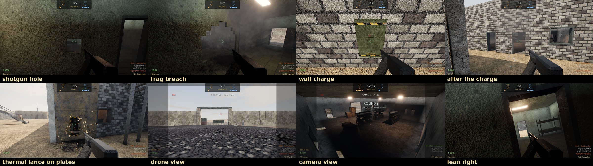

# COLD SECTOR

A tactical first-person shooter written in Python with Panda3D. It plays like a
round-based 5v5 (Counter-Strike style economy, objective and gunplay) with
Siege-style tactics (leaning, destructible soft walls, gadgets, drones and
cameras). It has an original modern-military theme. All names, maps,
weapons and characters are original. Third-party art is CC0 only.

> **Status: Milestone 6 of 7.** Milestone 6 adds the Siege side of the game:
> * **Destructible walls and floors.** Soft walls, a roof hatch and sheet-metal walls break chunk by chunk
>   under bullets, shotguns, knives, frags and charges, with dust and debris. Bots path through the holes.
> * **Reinforcement.** Defenders hold F to plate marked walls and hatches (2 each per round).
> * **Lean** with Q / E: the camera tilts and peeks, and your hit boxes lean with it. Bots peek too.
> * **A prep phase** before each round: defenders set up, attackers scout with **drones**; defenders
>   watch the map's **security cameras**. Anything you see can be **pinged** for your team.
> * **Eight specialists**, four per side, each with a unique gadget (thermal lance, pulse scanner,
>   breaching hammer, EMP grenade / razor wire, motion sensor, deployable shield, signal jammer),
>   plus buyable **wall charges**. Specialists and gadgets are data in `data/specialists.json`.
>
> Earlier milestones delivered the AI bots (5), rounds, economy and the bomb (4), the full map and
> post-processing (3), the weapons and hit detection (2), and the player controller and renderer (1).
> See [docs/ROADMAP.md](docs/ROADMAP.md).



*From `python main.py --demo m6`: a shotgun hole and a frag breach in the barracks, a wall charge on the
armory and the door it cuts, a thermal lance on a reinforced wall, a drone view, a camera view and a lean.*

## Requirements

* Python **3.11+**
* A GPU/driver with **OpenGL 3.3** (any GPU from the last ~12 years; macOS uses the 4.1 core profile)
* `pip install -r requirements.txt` (only `panda3d` and `numpy`)

## Install and run

```bash
python -m venv .venv
# Windows: .venv\Scripts\activate      Linux/macOS: source .venv/bin/activate
pip install -r requirements.txt

# optional but recommended: fetch CC0 2K textures + HDRI sky (Poly Haven / ambientCG)
python tools/download_assets.py

python main.py
```

`python main.py` starts a match on Kestrel Compound. Pick a side (Vanguard attacks, Bastion defends) and the
bot difficulty, and the first round starts with freeze time. The first match on a map also builds the bots'
navigation mesh (~2 s, cached in `assets/cache/nav`). The first start of a map takes
~30-90 s: procedural fallback textures are generated, the sky lighting is prefiltered and the map's
sky visibility is baked. Everything is cached in `assets/`, so later starts take a few seconds. If you are offline
or a download fails, the game generates its own textures and sky and runs
normally.

Useful options (`python main.py --help` lists them all):

| Option | Effect |
|---|---|
| `--map compound` / `--map test_range` | the full map (default) or the Milestone 1-2 test level with the shooting range |
| `--preset low/medium/high/ultra` | graphics quality (default `high`) |
| `--res 1920x1080 --fullscreen` | resolution / display mode |
| `--fov 80` | vertical FOV in degrees (74 ≈ 106° horizontal at 16:9) |
| `--gfx shadow_resolution=4096` | override any key from `data/graphics_presets.json` |
| `--no-vsync` | uncapped frame rate (for benchmarking) |
| `--shots` | render the map's predefined camera shots to `user/screenshots/` and exit |
| `--pose=x,y,z,heading,pitch` | start at a given eye position |
| `--demo weapons` | scripted tour of the Milestone 2 features on the test range. It saves screenshots and prints the damage results |
| `--demo routes` | walks every lane of the compound and prints PASS/FAIL per route |
| `--demo round` | plays scripted rounds against stand-ins: buying, a pistol round, a plant and detonation, then a defuse on the defending side. Prints the money after each step and saves `user/screenshots/demo_m4_*.png` |
| `--demo m6` | Milestone 6 tour against stand-ins: drone, soft walls, hatch, wall charge, thermal lance through a reinforced wall, defender gadgets, jammer vs. charge, EMP, pulse, lean and the round reset. Prints what broke and saves `user/screenshots/demo_m6_*.png` |
| `--demo bots` | watches a fast-forwarded 5v5 bot match (8 rounds; `BOT_DEMO_ROUNDS=n` to change, `BOT_DEMO_GADGETS=1` logs every gadget). Prints every kill with context, a summary with gadget use and any stuck bot, and saves `user/screenshots/demo_bots_*.png` |
| `--team attack` / `--team defend` | start the match on that side and skip the side selection |
| `--difficulty easy/normal/hard/expert` | bot difficulty (the side selection screen also sets it and remembers it) |
| `--opponents 5 --teammates 4` | roster size (also `bots <n> [mates]` in the console) |
| `--spectate` | watch a 5v5 bot match |
| `--bots off` | Milestone 4 practice: stand-ins that hold positions and do not shoot back |
| `--mode sandbox` | free play on the compound without rounds (`--mode match` / `auto` is the default on maps with bomb sites) |
| `--seed 3` | fixed random seed (spawns, bomb carrier, bot decisions) for reproducible rounds |
| `--post-debug 1..4` | start with a post-processing debug view (AO, bloom, normals, depth); F3 in game |
| `--save-settings` | persist the CLI overrides to `user/settings.json` |

## Controls

| Key | Action |
|---|---|
| Mouse | look (CS-style sensitivity scale: `input.sensitivity` in `user/settings.json`, default 2.0) |
| W A S D | move |
| Shift (hold) | walk: quiet footsteps, slower |
| Ctrl (hold) | crouch (crouch in the air = crouch-jump) |
| Space | jump |
| Q / E (hold) | lean left / right (peek; your hit boxes lean too) |
| Left mouse | fire / knife slash / throw grenade (hold to prime, release to throw) |
| Right mouse | aim down sights (hold) / sniper scope (click cycles 2 zoom levels) / knife stab / underhand grenade lob |
| R | reload |
| F | pick up the weapon or ammo you are looking at |
| F (hold) | reinforce the marked wall or hatch you look at (defenders, 2.5 s, 2 per round) |
| X | specialist gadget: place / throw / swing / scan |
| C | wall charge (attackers): stick it on a soft wall or hatch, it blows after 3 s |
| 6 | drones (attackers: throws one if you have none out) / cameras (defenders). In a view: mouse looks, WASD drives the drone, Space hops, left mouse pings, Q / E switch view, 6 leaves |
| Middle mouse | ping what you look at (an enemy, a gadget, or a spot) for your team |
| G | drop the current weapon |
| Y | inspect weapon |
| 1 2 3 4 | primary / pistol / knife / grenades (press 4 again to cycle grenade types) |
| 5 | breach charge (attackers). Hold left mouse inside a bomb site to plant (3.2 s) |
| F (hold) | defuse the planted charge while looking at it (10 s, 5 s with a defuse kit) |
| B | buy menu (in your buy zone during buy time); its last tab (7) picks your specialist |
| Tab (hold) | scoreboard |
| ` or F10 | developer console (`help` lists the commands) |
| Mouse wheel, Z | next/previous weapon, last weapon |
| V | noclip fly mode (debug) |
| Left / right mouse (dead) | spectate the next / previous player (teammates first) |
| Space (dead) | free spectator camera (WASD to fly), Space again to follow players |
| Esc | pause menu (resume, settings, quit); Esc again goes back |
| F1 | toggle debug overlay |
| F3 | cycle post-processing debug views (final, AO, bloom, normals, depth) |
| F12 | screenshot to `user/screenshots/` |

Key bindings live in `user/settings.json` (`input.binds`) after the first `--save-settings`.

## Milestone 6 - what to test

Start with `python main.py`. Rounds now go **freeze time (8 s, buy) -> preparation (20 s) -> live**. In the
preparation phase defenders can move, reinforce and set up; attackers stay at spawn and scout with drones;
nobody can be hurt. Open the buy menu (B) and pick a specialist on the last tab (7); bots take the others.

1. **Soft walls.** Barracks and HQ have plaster interior walls; site A (the armory) has an office with
   plaster walls and block outer walls; site B (the motor pool) has sheet-metal walls; the armory roof has a
   hatch above the site (stairs up on the armory's west side).
   * A rifle chips a small hole after a few rounds in the same place; a shotgun blast opens one at once.
   * The knife and Maul's hammer smash holes; a frag blows a big one; the bomb levels nearby walls.
   * Block walls shrug off bullets: they need charges, the lance or the bomb.
   * Look and shoot through holes; walk or crouch through big ones; drop through an opened hatch.
2. **Reinforcement** (defend). Look at the armory office walls, the armory's east/west walls, the motor
   pool's east wall or the hatch (from below) and hold **F** for 2.5 s. Reinforced walls stop bullets,
   frags and wall charges; only Kiln's thermal lance cuts through.
3. **Lean** with Q / E, standing still or moving. Peek a corner and see how little of you shows; bots
   watching an angle from cover lean out to look and shoot.
4. **Drones** (attack, key 6 in prep or later). Drive into the map, hop up steps, left-click enemies to
   ping them. A ping shows a red marker through walls for your team, and bot teammates use it.
   Defenders shoot drones; Ember's jammer cuts their signal.
5. **Cameras** (defend, key 6). Six cameras cover the approaches and both sites; pan with the mouse, switch
   with Q / E, ping with left mouse. Attackers shoot them out; dead defender bots keep watching them.
6. **Gadgets** (X) - try each specialist:
   * Attack: **Kiln** thermal lance (any wall, 4 s burn), **Vesper** pulse (enemies within 15 m pinged),
     **Maul** breaching hammer, **Static** EMP grenade (disables cameras, sensors, jammers and drones for
     12 s).
   * Defence: **Bramble** razor wire (slows to a crawl and rattles), **Lantern** motion sensors (ping runners
     in front of them), **Bulwark** bullet-proof shield, **Ember** signal jammer (charges and lances inside
     5 m stop, drones lose signal).
   * Buy **wall charges** (gear tab, attackers, $300, 2 extra) and use them with C.
7. **Bots and gadgets.** Spectate (`--spectate`) or play with bots:
   * in prep, defenders reinforce their site and put wire, sensors, shields and jammers down, and
     attackers drive drones towards the target site;
   * in the round one attacker breaches a site wall before the execute (charge, lance or hammer) and the
     team pushes through the hole; Vesper pulses, Static EMPs known electronics, and everyone shoots
     enemy cameras, sensors, jammers and drones they see.
8. **Console** (`): `specialist kiln`, `gadgets` (refill), `walls` (rebuild), `prep 40`.

Please tell me how the destruction feels (chunk size, how many bullets a wall takes), whether the prep phase
length is right, and which gadgets feel too strong or too weak.

## Milestone 5 - what to test

Start with `python main.py`, pick a side and a difficulty (Normal is the default). You have four bot teammates
against five bots. The team radio at the left shows what your teammates see and do ("Enemy spotted: B Long",
"Rotating to A", "Planting at B!"). Things to try:

1. **Fighting bots.** Peek them at different ranges with different guns.
   * Bots need a moment to react when you appear (from 0.55-0.85 s on Easy to 0.14-0.22 s on Expert).
   * Their first shots are less accurate than later ones, and more so when you or they are moving.
   * Like you, they are inaccurate while running: they stop (counter-strafe) before shooting.
   * They burst at range and spray up close, crouch for long shots, and strafe between bursts (more often on
     the harder difficulties).
   * Hide behind cover: a hurt bot or one with an empty gun falls back to cover and reloads.
   * Hide only your body: if just your head shows, that is what they shoot at.
2. **Sound.** Run (Shift walks silently) near a bot that cannot see you: it turns to the doorway or corner
   you will come through, and tells its team. Gunshots carry much further than footsteps.
3. **Attacking with bots.** Each round the bot team picks a site and a plan, announced on the radio:
   * an **execute**: it gathers outside the site on one or two lanes, then goes in together after a
     flash (and a smoke on the defenders' way back);
   * a **rush**;
   * or **map control**: spreading out, then committing to the quieter site.
   One player gets the breach charge at random. If it is you, the bots switch to the site you head for.
   If a carrier dies, the nearest bot fetches the charge. After the plant they hold positions with a
   view of the charge and run before it blows.
4. **Defending with bots.** Bots hold the map's angles at A, B and Mid. They rotate when two or more enemies
   show up at a site, walking the last metres in. After a plant they regroup outside the site and retake
   together (the best placed bot defuses, a kit holder first). They save when there is no time left to
   defuse.
5. **Grenades.** Watch for bot flashes (look away!), smokes during executes and frags thrown at players
   hiding behind cover.
6. **Difficulty.** Compare Easy and Expert on the side selection screen (or `difficulty expert` in the
   console). The values are in `data/bots.json`.
7. **Spectating.** When you die you follow your teammates over the shoulder. Left and right mouse switch
   player, Space flies freely. The HUD shows the spectated bot's health, armour, ammo and plant or defuse
   progress. **WATCH A BOT MATCH** on the side selection (or `--spectate`) lets ten bots play.
8. **Console** (`): `botinfo` lists what every bot is doing, `bots 5 0` plays alone against five,
   `difficulty hard`, `spectate`.

Please tell me which difficulty feels right, whether bots feel unfair anywhere (seeing or hitting you too
early) or dumb anywhere (getting stuck, walking into the open, ignoring you), and your FPS with ten bots.

`python main.py --bots off` brings back the Milestone 4 stand-ins for buy and defuse practice.

## Milestone 4 - what to test

Run `python main.py --bots off` and pick **Vanguard** (attack). The match is the first to 13 rounds out of
24, and the sides swap after round 12. In this practice mode the 5 opponents are stand-ins: they stand or
crouch at common angles, do not move or shoot, and die and drop their rifle like players.

1. **Freeze time and buying.** Each round starts with freeze time (12 s in Milestone 4; since Milestone 6 it is 8 s followed by a 20 s preparation phase): you can look around and buy but
   not move or shoot. Buying is allowed for 20 s after that while you are in your spawn's buy zone. The
   HUD shows `[B] BUY` and the time left.
   * Press **B**. Number keys pick a category, then an item (e.g. **3 1** = first rifle), or click.
     Items you cannot afford or carry are greyed out, and the reason shows on the right.
   * Each side has its own rifle: the R7 Halberd for attackers, the C9 Lancer for defenders. The defuse
     kit is defender-only.
   * Right-click an item you bought this round to sell it back (only while buy time lasts).
   * Buying a primary when you already carry one drops the old one at your feet.
   * Armour costs $650. Armour + helmet costs $1000, or $350 if your armour is already full.
   * Grenades: at most 4 in total, 2 flashbangs, 1 frag and 1 smoke.
2. **Economy** (CS rules; the values are in `data/match.json`).
   * Everyone starts with $800. The maximum is $16,000.
   * A round win pays $3250 (elimination or time) or $3500 (detonation or defuse).
   * A loss pays a bonus of $1400, rising by $500 per consecutive loss up to $3400. A win lowers the
     streak by one, so a team that wins one round in a long losing streak still gets a big bonus later.
   * Attackers who lose after planting get $800 extra. Planting and defusing pay the player $300.
   * Kill rewards depend on the weapon: rifles $300, SMG $600, shotgun $900, sniper $100, knife $1500,
     grenades $300. Money pop-ups appear next to your money.
   * Watch the money after each round; the scoreboard (**Tab**) shows everyone's money and round history.
3. **The breach charge.** One attacker carries it. When you are on attack, it is you; the icon shows
   bottom-right.
   * Press **5**, walk into site A (armory) or B (motor pool), and hold left mouse for 3.2 s. Letting go
     resets the plant. You cannot move while planting, and you cannot plant in the air.
   * Once planted, the round timer becomes the 40 s bomb timer. The charge beeps faster and faster and its
     LED blinks.
   * The explosion kills anyone within about 20 m (armour helps a little) and hurts up to 45 m, through
     walls. Run.
   * If you die while carrying it, it drops; walk over it to pick it up. **G** while holding it drops it.
4. **Defusing.** Switch sides with the console (`team defend`), then `plant A` or `plant B` to get a
   planted charge, and go there.
   * Look at the charge and hold **F**: 10 s, or 5 s with a defuse kit. You cannot move while defusing,
     and letting go resets.
   * A defuse wins the round even if the timer is nearly out. If it runs out first, attackers win.
5. **Round ends.** A side wins when the other side is eliminated, the round time runs out (defenders win),
   the charge detonates (attackers win) or the charge is defused (defenders win). Then:
   * a banner shows the winner, the reason and the MVP
   * the round resets after 6 s; survivors keep their weapons and armour, the dead get a knife and pistol
   * at halftime (after round 12) money resets to $800, the sides swap and everyone is re-equipped
6. **Death.** Use the console `kill` or let the charge get you. You see YOU DIED, and after 2.5 s a free
   spectator camera (fly with WASD) until the next round.
7. **HUD.** Check the score bar (team scores, clock, alive pips per side), the kill feed (top right: killer,
   assist, weapon, headshot), the banners, the plant and defuse progress bars, and the
   bomb and kit icons.
8. **Console** (` or F10): `help`, `money 16000`, `plant A`, `endround attack`, `team defend`,
   `bots 3`, `god`, `give sr90`, `freeze 3`, `restart`. Handy for testing a full-buy round straight away.

Tell me how the economy feels over a few rounds, whether the timers feel right, and anything in the buy menu
or HUD that is hard to read.

`python main.py --mode sandbox` keeps the Milestone 3 free walk of the map without rounds.

## Milestone 3 - what to test

1. **Walk the map.** Spawn is the attackers' staging area outside the south wall. The location name is shown
   bottom-left (e.g. *A Long*, *Mid Doors*, *Tunnel*). Try the three lanes to each site:
   * **A (Armory):** west gate → *A Long* alley; or west gate → *Barracks* (south door, corridor, north door);
     or main gate → *Mid* → *A Connector*. All three end in the *West Yard*, at the armory's loading door.
   * **B (Motor Pool):** east gate → *B Long* road; or east gate → down the ramp into the *Bunker* →
     *Tunnel* → stairs up into the *B Yard*; or *Mid* → *B Connector*.
   * **Defenders:** spawn in front of the HQ. Walk *Mid Doors*, through the HQ (west to east door), and up the
     *comms tower* stairs to the platform overlooking A.
   * Tell me about anything you can get stuck on, see through, or fall out of. Also tell me which lanes feel
     too long, too open, or too cramped.
2. **Graphics settings:** ESC → Settings → Graphics.
   * Switch presets, then single options. They apply live when you press **Apply** and are saved.
   * Compare ambient occlusion Off/High in the barracks corridor and around crates (F3 shows the raw AO).
   * Try anti-aliasing FXAA vs MSAA 4x on the T-wall edges and the hangar beams.
   * Lower the render scale to 70% with sharpening 50%: that is the fps-saving option.
   * Bloom: look at the lamps in the bunker and fire a few shots in the dark (muzzle flash glow).
   * Eye adaptation: walk from the bright yard into the armory or the bunker and back. The image re-exposes
     over about a second. Brightness in the Display tab offsets the exposure.
   * Display: resolution, fullscreen, frame-rate limit, FOV (the horizontal value is shown) and weapon FOV.
     Gameplay: sensitivity, zoom sensitivity and the crosshair editor (changes show live).
3. **Performance:** please tell me your GPU, resolution, preset and FPS in a few places. Good places are mid,
   B site, and looking across the map from the comms tower. Which options cost you the most?

Run `python main.py --map test_range` for the Milestone 2 shooting range (dummies, spray wall, penetration
panels, weapon racks). Its checklist follows.

## Milestone 2 - what to test

On `--map test_range` you spawn at the **shooting range** (north end of the test level) with the R7 Halberd rifle, the P9
pistol, a knife, one frag, two flashbangs and one smoke. The bench in front of you holds every gun
(rifles and the SMG to the left; shotgun, sniper and pistol in the middle). Look at one and press **F**.
The ammo, armour and grenade boxes are at the right end of the bench. Rack items come back after you
take them. Ammo is limited, so reload and refill at the ammo box.

1. **Targets.** The dummies are at 10 m (one armoured with a helmet, one unarmoured), 20 m (helmet + vest,
   vest only), 30 m (unarmoured), and one moving left and right at about 18 m. Each one shows the
   damage per hit, the hit group, the armour left and burst totals. A dummy topples at 0 HP and
   stands up again after a few seconds.
   - One R7 headshot kills the armoured, helmeted dummy. Body shots take 4 hits through armour.
   - Hit markers: white for a hit, yellow for a headshot, red for a kill.
   - Armour: armour absorbs part of each body hit and is used up as it does (CS-style; each weapon has its
     own armour penetration). Legs are never armoured. Against a helmet, only the R7 and the sniper
     kill with one headshot. The C9, SMG, pistol and shotgun need two. This is the CS-style rifle
     trade-off: the R7 hits harder, the C9 fires faster and is easier to control.
2. **Accuracy.** Shoot while standing still, then while running: running shots spray wildly. Then walk
   (Shift), crouch and jump. The crosshair opens to show the current spread. The first shot when
   standing still goes exactly where you aim. Tapping keeps your shots tight.
3. **Recoil.** Stand about 10 m from the **SPRAY WALL** (the lone concrete wall with a sign, to the
   right of the range past the end of the bench). Spray without pulling down. The bullet holes trace
   the weapon's fixed pattern: up first, then left and right. Spray again and you get the same
   pattern, so it can be learned and compensated. Every gun has its own pattern. Recoil recovers when
   you stop firing.
4. **Penetration.** The 5 panels left of the range (plywood, plaster, sheet steel, brick, concrete) each
   have a dummy behind them. Bullets go through plywood, plaster and sheet steel (with reduced damage),
   but not brick or concrete. Rifles penetrate more than the SMG or pistol.
5. **Damage falloff.** The shotgun one-shots up close. At 10 m it takes one or two shots, and beyond
   20 m it is weak, because pellets lose damage and spread out. The SMG and pistol lose noticeably more damage over range than the rifles.
   A sniper body shot kills an unarmoured dummy at any range.
6. **Weapons and animations.**
   - Hold right mouse to aim down the sights (iron sights on every gun).
   - SR-90: right-click for the scope overlay, right-click again for the 2nd zoom. It is a bolt action, so
     watch the bolt cycle. The scope drops after each shot.
   - S12 shotgun: loads one shell at a time and you can fire to interrupt.
   - Reload from a partly full and from an empty magazine (the empty one also racks the bolt).
   - Inspect with **Y**. Knife: left slash, right stab (backstab = more damage).
7. **Grenades** (key 4, press again to cycle). Hold left mouse to pull the pin, release to throw.
   Right mouse gives a short underhand lob. Grenades bounce off walls and floors.
   - Frag: explosion, damage through line of sight only (hide behind a bench), crater decal, screen shake.
   - Smoke: a volume cloud that blocks vision for about 18 s.
   - Flashbang: blinds you if you look at it. Turning away shortens the effect.
8. **Effects.** Look for:
   - muzzle flash with a light pulse on nearby walls
   - tracers on every 3rd rifle round (every 4th for the SMG; every sniper round)
   - ejected brass that bounces
   - per-surface bullet holes and particles: sparks on metal, dust on concrete, splinters on wood
   - viewmodel sway and bob, and a landing dip. The viewmodel is drawn with its own FOV, so it never
     clips into walls
9. **Pickups.** Press **G** to drop a gun, then walk over it to pick it back up. When the slot is full,
   **F** on a rack swaps your gun.
10. **Audio.** Gunshots, impacts, reloads, footsteps and explosions are synthesised procedurally on the
    first start (cached in `assets/cache/sounds`). They are positioned in 3D, so close your eyes and
    turn. These are placeholders until the audio pass in Milestone 7.

To see everything without playing, run `python main.py --demo weapons`. It shoots each target, prints the
damage it did in the console and writes `user/screenshots/demo_*.png`.

The Milestone 1 areas are still there on the test range: the movement course, the house, the container yard
and the PBR gallery. Use `V` (noclip) to fly back to the road. The checklist from Milestone 1 is below.

## Milestone 1 - what to test

Use `--map test_range --pose=0,-52,1.77,0,0` to start at the south end of the road, facing north (the
Milestone 1 spawn).

1. **Movement feel**
   - Run (5.4 m/s), walk with Shift (2.75 m/s) and crouch with Ctrl (1.85 m/s). Watch the speed readout in the overlay.
   - Counter-strafe: tap the opposite key and you stop quickly (Source-style friction and acceleration).
   - Jump (~1 m). Air control is limited, so you cannot change direction mid-air.
2. **Movement course** (south-east of the road, the row of grey blocks): 0.25 m and 0.42 m blocks
   are stepped up automatically. 0.6 m and 0.9 m need a jump. 1.3 m needs a **crouch-jump**
   (jump, then hold Ctrl). 1.7 m is out of reach.
   - Crouch tunnel (1.35 m clearance) east of the blocks: you cannot stand up inside it.
   - Ramps: 20° and 35° are walkable, 50° is too steep.
   - Concrete stairs to a platform.
3. **House** (west of the road): tiled ground floor, interior stairs to the wooden upper floor,
   a balcony on the east side and a catwalk over the road to the steel platform and stairs.
   - Check that the interior is darker than outside and lit by the warm lamps.
   - Look for shadows cast by door frames and crates under the lamps.
4. **Graphics**
   - Sun shadows: soft edges, no shimmering when you turn, and no striped "acne" on lit walls.
     Shadows stay sharp near you and fade out far away.
   - PBR spheres (north of the material wall): rough, glossy, plastic, gold, chrome, copper.
   - Material wall (row of cubes): every material, including parallax on the brick.
   - Container yard: corrugated containers, an open container lit inside, and a floodlight.
   - Compare presets: `python main.py --preset low` vs `--preset ultra`.
5. **Performance:** the overlay shows FPS and frame time. Please tell me your GPU, resolution, preset and FPS.

## Project layout

```
main.py                 entry point
engine/                 app/game loop, fixed timestep (64 Hz), settings, input, physics, mesh building
gameplay/               character controller (shared by player & bots), player, damage model, hitboxes, dummies,
                        match rules (match.py), director (match <-> world), shop, bomb, stand-in agents,
                        third-person soldier body (body.py), spectator camera, lean, destructible panels
                        (destruction.py), the Siege layer (tactical.py: kits, pings, views), gadgets.py,
                        drones and cameras (observation.py)
render/                 renderer, PBR materials, procedural textures, CSM, local lights, IBL, sky visibility,
                        post pipeline (pre-pass, GTAO, bloom, eye adaptation, tonemap, AA), particles, decals, effects
render/shaders/         GLSL (commented: every technique is explained in place)
maps/                   level builder, prefabs (prefabs.py basics, prefabs_military.py compound pieces),
                        map JSON files in maps/data/ (compound, test_range, showroom)
data/                   data-driven configs: materials, graphics presets, movement, weapons, weapon models, surfaces,
                        match rules and economy (match.json), bot difficulty and behaviour (bots.json),
                        specialists and gadgets (specialists.json), destruction (destruction.json)
weapons/                weapon defs, gunplay model, ballistics, viewmodel + animations, inventory, grenades, pickups
ui/                     HUD, crosshair, debug overlay, pause + settings menus (menus.py on widgets.py),
                        match HUD + scoreboard, buy menu, team select, developer console
audio/                  procedural sound synthesis (placeholder library) + 3D audio system
ai/                     bots: navmesh (generation, A*, funnel), off-mesh links through holes (navlinks.py),
                        path following, perception, aiming, brain (modes and combat), team tactics, buying,
                        gadget use (gadget_ai.py)
assets/                 downloaded / generated textures, HDRIs, caches (not committed)
tools/                  download_assets.py, generate_textures.py
tests/                  unit tests (python -m unittest discover -s tests -t .)
docs/                   RENDERING.md, ROADMAP.md
```

## Adding a map

Maps are JSON files in `maps/data/` built from prefabs:

* **Basic pieces:** `floor`, `wall` (door/window openings, a different material on each side), `stairs`,
  `ramp`, `box`, `crate`, `crate_stack`, `container`, `sandbags`, `barrel`, `pillar`, `railing`,
  `catwalk`, `light`, `spawn` and `group` (an offset and rotated block of pieces).
* **Destructible pieces:** any `wall` with `"soft": true` becomes chunked panels (`"reinforce": true` lets
  defenders reinforce it, `"breach": true` marks it for the bots' breaches, `"surface"` picks its strength in
  `data/destruction.json`); a `building` takes `"soft": {"e": {...}}` per side, `"hatches"` in the roof and
  `"parapet_gaps"`; a `canopy` takes the same flags per sheet wall. `camera` places a security camera.
* **Compound pieces:**
  * `building`: a shell with openings per side, a parapet and an interior finish
  * barriers: `twall`, `jersey`, `gabion`, `boom_gate`
  * `vehicle` (truck / utility), `canopy` (hangar), `mast`
  * `furniture`: bunk, locker, shelf, desk, workbench, fuel tank, flagpole...
  * `terrain` (backdrop hills) and `paint_line`
* **Gameplay data:** `zone` (bomb sites and buy zones, with a `team` for buy zones), `callout` (named areas),
  `spawn`, plus `practice_positions` (defender hold spots with the angle to watch, attacker lurk spots;
  also where stand-ins stand), `test_routes` (waypoint walks checked by `--demo routes`; routes that end in
  a bomb site are the attackers' lanes) and `camera_shots` (for `--shots`). A map with both bomb sites
  starts in match mode.
* **Bots** need nothing else: the navigation mesh is generated from the map's collision boxes on first
  start and cached.

Run a map with `python main.py --map <name>`.

## Tests

```bash
python -m unittest discover -s tests -t . -v
```

The tests cover:

* the character controller: stairs, slopes, ledges, crouch, crouch-jump, depenetration, footsteps
* the fixed timestep, IBL maths and HDRI orientation
* the asset downloader (with a mocked network)
* fire rates, recoil patterns and recovery, inaccuracy (first shot, moving, crouched, in the air)
* reloads, including shell-by-shell; the armour and helmet damage model and falloff
* hitbox raycasts, wall penetration per material, and the inventory and grenade maths
* graphics option normalisation, the settings menu model (presets, overrides, restart detection)
* map integrity: known prefabs and materials, both bomb sites, both spawn groups, callouts, no
  overlapping (z-fighting) floor slabs, and spawns and stand-in positions free of colliders
* the match state machine: phases, round wins, loss bonus streaks, plant/defuse rewards, halftime swap,
  match end, friendly fire
* the shop (team items, refunds, grenade limits, helmet upgrade, buy zone and time) and the bomb maths
* the navmesh: walls and doors, erosion, stairs, ledges, crouch-only areas, two-level areas, unreachable
  rooms, the cache, string pulling; characters following paths through real Bullet collision, and every
  lane of the compound
* bot aiming (turn speed, convergence, aim error decay, spray control), grenade arcs, bot buying and lanes
* bot perception: view cone, walls, peripheral vision, reaction delay, flash blindness, hearing
* destruction: chunk damage, collision through holes, explosions, door-sized cuts, reinforcement, the thermal
  lance, round reset, decal removal, navmesh links through wall holes and one-way drops through hatches
* lean (timing, wall clearance, body roll), the prep phase, specialist data and gadget models

## Troubleshooting

* **Black screen or shader errors:** update your GPU driver; the game needs OpenGL 3.3. Run from a
  terminal and send me the log.
* **Low FPS:** ESC → Settings → Graphics. The biggest wins are render scale (with sharpening),
  ambient occlusion, MSAA, and shadow quality. Or start with `--preset medium` / `low`.
* **Textures look procedural:** run `python tools/download_assets.py`. It prints which assets it
  fetched and writes `assets/CREDITS.md`.
* **Stale lighting after changing a map:** delete `assets/cache/`.
* **No sound:** the game runs muted if Panda3D finds no audio device (the console says so). To
  regenerate the procedural sounds, delete `assets/cache/sounds/`.
