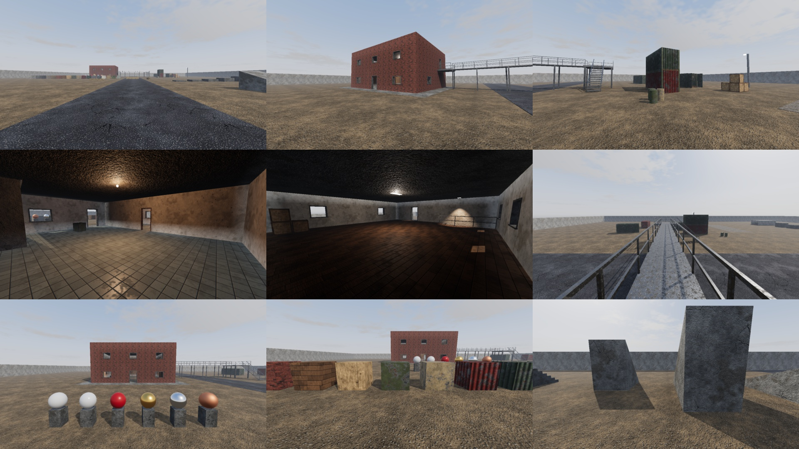

# COLD SECTOR

A tactical first-person shooter written in Python with Panda3D. It plays like a
round-based 5v5 (Counter-Strike style economy, objective and gunplay) with
Siege-style tactics (leaning, destructible soft walls, gadgets, drones and
cameras). It has an original modern-military theme. All names, maps,
weapons and characters are original. Third-party art is CC0 only.

> **Status: Milestone 1 of 7** - player controller, movement, test level with
> PBR materials, cascaded shadows, shadowed local lights, IBL and an HDR
> post chain. See [docs/ROADMAP.md](docs/ROADMAP.md).



*Milestone 1 test range, rendered with the offline fallback (procedural textures and sky).
Every rendering technique is explained in [docs/RENDERING.md](docs/RENDERING.md).*

## Requirements

* Python **3.11+**
* A GPU/driver with **OpenGL 3.3** (any GPU from the last ~12 years; macOS uses the 4.1 core profile)
* `pip install -r requirements.txt` (only `panda3d` and `numpy`)

## Install and run

```bash
python -m venv .venv
# Windows: .venv\Scripts\activate      Linux/macOS: source .venv/bin/activate
pip install -r requirements.txt

# optional but recommended: fetch CC0 2K textures + HDRI sky (Poly Haven / ambientCG)
python tools/download_assets.py

python main.py
```

The first start takes ~30-60 s: procedural fallback textures are generated,
the sky lighting is prefiltered and the level's sky visibility is baked. Everything
is cached in `assets/`, so later starts take a few seconds. If you are offline
or a download fails, the game generates its own textures and sky and runs
normally.

Useful options (`python main.py --help` lists them all):

| Option | Effect |
|---|---|
| `--preset low/medium/high/ultra` | graphics quality (default `high`) |
| `--res 1920x1080 --fullscreen` | resolution / display mode |
| `--fov 80` | vertical FOV in degrees (74 ≈ 106° horizontal at 16:9) |
| `--gfx shadow_resolution=4096` | override any key from `data/graphics_presets.json` |
| `--no-vsync` | uncapped frame rate (for benchmarking) |
| `--shots` | render the map's predefined camera shots to `user/screenshots/` and exit |
| `--pose x,y,z,heading,pitch` | start at a given eye position |
| `--save-settings` | persist the CLI overrides to `user/settings.json` |

## Controls (Milestone 1)

| Key | Action |
|---|---|
| Mouse | look (CS-style sensitivity scale: `input.sensitivity` in `user/settings.json`, default 2.0) |
| W A S D | move |
| Shift (hold) | walk: quiet footsteps, slower |
| Ctrl (hold) | crouch (crouch in the air = crouch-jump) |
| Space | jump |
| V | noclip fly mode (debug) |
| Esc | release / recapture the mouse (click also recaptures) |
| F1 | toggle debug overlay |
| F12 | screenshot to `user/screenshots/` |

Key bindings live in `user/settings.json` (`input.binds`) after the first `--save-settings`.

## Milestone 1 - what to test

Spawn is at the south end of the road, facing north.

1. **Movement feel**
   - Run (5.4 m/s), walk with Shift (2.75 m/s) and crouch with Ctrl (1.85 m/s). Watch the speed readout in the overlay.
   - Counter-strafe: tap the opposite key and you stop quickly (Source-style friction and acceleration).
   - Jump (~1 m). Air control is limited, so you cannot change direction mid-air.
2. **Movement course** (south-east of the road, the row of grey blocks): 0.25 m and 0.42 m blocks
   are stepped up automatically. 0.6 m and 0.9 m need a jump. 1.3 m needs a **crouch-jump**
   (jump, then hold Ctrl). 1.7 m is out of reach.
   - Crouch tunnel (1.35 m clearance) east of the blocks: you cannot stand up inside it.
   - Ramps: 20° and 35° are walkable, 50° is too steep.
   - Concrete stairs to a platform.
3. **House** (west of the road): tiled ground floor, interior stairs to the wooden upper floor,
   a balcony on the east side and a catwalk over the road to the steel platform and stairs.
   - Check that the interior is darker than outside and lit by the warm lamps.
   - Look for shadows cast by door frames and crates under the lamps.
4. **Graphics**
   - Sun shadows: soft edges, no shimmering when you turn, and no striped "acne" on lit walls.
     Shadows stay sharp near you and fade out far away.
   - PBR spheres (north of the material wall): rough, glossy, plastic, gold, chrome, copper.
   - Material wall (row of cubes): every material, including parallax on the brick.
   - Container yard: corrugated containers, an open container lit inside, and a floodlight.
   - Compare presets: `python main.py --preset low` vs `--preset ultra`.
5. **Performance:** the overlay shows FPS and frame time. Please tell me your GPU, resolution, preset and FPS.

## Project layout

```
main.py                 entry point
engine/                 app/game loop, fixed timestep (64 Hz), settings, input, physics, mesh building
gameplay/               kinematic character controller (shared by player & bots), player controller
render/                 renderer, PBR materials, procedural textures, CSM, local lights, IBL, sky visibility, post
render/shaders/         GLSL (commented: every technique is explained in place)
maps/                   modular level builder (prefabs) + map JSON files in maps/data/
data/                   data-driven configs: materials, graphics presets, movement (weapons/specialists later)
ui/                     HUD, crosshair, menus (more in later milestones)
audio/ weapons/ ai/     filled in by milestones 2, 5, 7
assets/                 downloaded / generated textures, HDRIs, caches (not committed)
tools/                  download_assets.py, generate_textures.py
tests/                  unit tests (python -m unittest discover -s tests -t .)
docs/                   RENDERING.md, ROADMAP.md
```

## Adding a map

Maps are JSON files in `maps/data/` built from prefabs (`maps/prefabs.py`):
`floor`, `wall` (with door/window openings and a different material on each side),
`stairs`, `ramp`, `box`, `crate`, `crate_stack`, `container`, `sandbags`,
`barrel`, `pillar`, `railing`, `catwalk`, `light`, `spawn`, and `group` (a reusable
offset/rotated block of pieces). Run it with `python main.py --map <name>`.

## Tests

```bash
python -m unittest discover -s tests -t . -v
```

The tests cover the character controller (stairs, slopes, ledges, crouch, crouch-jump,
depenetration, footsteps), the fixed timestep, IBL maths and HDRI orientation, and the
asset downloader (with mocked network).

## Troubleshooting

* **Black screen or shader errors:** update your GPU driver; the game needs OpenGL 3.3. Run from a
  terminal and send me the log.
* **Low FPS:** try `--preset medium` or `low`, or `--gfx shadow_resolution=1024`.
* **Textures look procedural:** run `python tools/download_assets.py`. It prints which assets it
  fetched and writes `assets/CREDITS.md`.
* **Stale lighting after changing a map:** delete `assets/cache/`.
