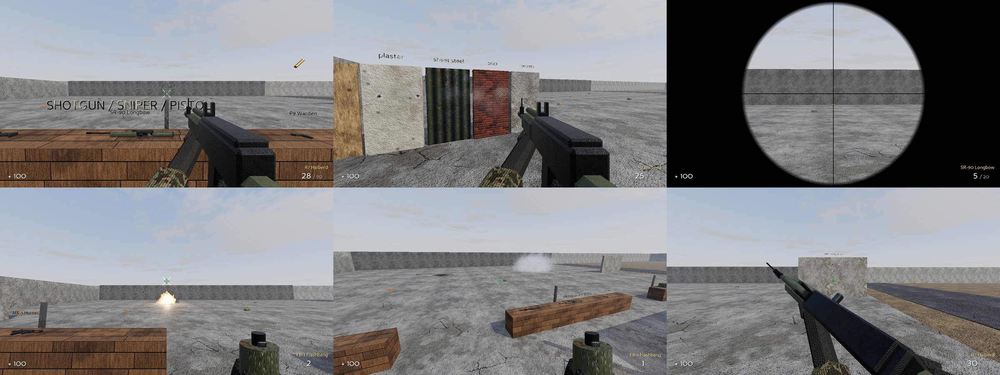

# COLD SECTOR

A tactical first-person shooter written in Python with Panda3D. It plays like a
round-based 5v5 (Counter-Strike style economy, objective and gunplay) with
Siege-style tactics (leaning, destructible soft walls, gadgets, drones and
cameras). It has an original modern-military theme. All names, maps,
weapons and characters are original. Third-party art is CC0 only.

> **Status: Milestone 2 of 7.** Milestone 2 adds weapons with fixed recoil patterns, hitbox-based hit
> detection with wall penetration, grenades, pickups, a first-person viewmodel and impact effects
> (decals, particles, muzzle flash, tracers, shell casings). Milestone 1 delivered the player
> controller, the PBR test level, cascaded shadows, IBL and the HDR post chain.
> See [docs/ROADMAP.md](docs/ROADMAP.md).



*The Milestone 2 shooting range, rendered with the offline fallback (procedural textures, sky and sounds).
Each rendering technique is explained in [docs/RENDERING.md](docs/RENDERING.md).*

## Requirements

* Python **3.11+**
* A GPU/driver with **OpenGL 3.3** (any GPU from the last ~12 years; macOS uses the 4.1 core profile)
* `pip install -r requirements.txt` (only `panda3d` and `numpy`)

## Install and run

```bash
python -m venv .venv
# Windows: .venv\Scripts\activate      Linux/macOS: source .venv/bin/activate
pip install -r requirements.txt

# optional but recommended: fetch CC0 2K textures + HDRI sky (Poly Haven / ambientCG)
python tools/download_assets.py

python main.py
```

The first start takes ~30-60 s: procedural fallback textures are generated,
the sky lighting is prefiltered and the level's sky visibility is baked. Everything
is cached in `assets/`, so later starts take a few seconds. If you are offline
or a download fails, the game generates its own textures and sky and runs
normally.

Useful options (`python main.py --help` lists them all):

| Option | Effect |
|---|---|
| `--preset low/medium/high/ultra` | graphics quality (default `high`) |
| `--res 1920x1080 --fullscreen` | resolution / display mode |
| `--fov 80` | vertical FOV in degrees (74 ≈ 106° horizontal at 16:9) |
| `--gfx shadow_resolution=4096` | override any key from `data/graphics_presets.json` |
| `--no-vsync` | uncapped frame rate (for benchmarking) |
| `--shots` | render the map's predefined camera shots to `user/screenshots/` and exit |
| `--pose=x,y,z,heading,pitch` | start at a given eye position |
| `--demo weapons` | scripted tour of the Milestone 2 features. It saves screenshots and prints the damage results |
| `--save-settings` | persist the CLI overrides to `user/settings.json` |

## Controls

| Key | Action |
|---|---|
| Mouse | look (CS-style sensitivity scale: `input.sensitivity` in `user/settings.json`, default 2.0) |
| W A S D | move |
| Shift (hold) | walk: quiet footsteps, slower |
| Ctrl (hold) | crouch (crouch in the air = crouch-jump) |
| Space | jump |
| Left mouse | fire / knife slash / throw grenade (hold to prime, release to throw) |
| Right mouse | aim down sights (hold) / sniper scope (click cycles 2 zoom levels) / knife stab / underhand grenade lob |
| R | reload |
| F | pick up the weapon or ammo you are looking at |
| G | drop the current weapon |
| Y | inspect weapon |
| 1 2 3 4 | primary / pistol / knife / grenades (press 4 again to cycle grenade types) |
| Mouse wheel, Z | next/previous weapon, last weapon |
| V | noclip fly mode (debug) |
| Esc | release / recapture the mouse (click also recaptures) |
| F1 | toggle debug overlay |
| F12 | screenshot to `user/screenshots/` |

Key bindings live in `user/settings.json` (`input.binds`) after the first `--save-settings`.

## Milestone 2 - what to test

You spawn at the **shooting range** (north end of the test level) with the R7 Halberd rifle, the P9
pistol, a knife, one frag, two flashbangs and one smoke. The bench in front of you holds every gun
(rifles and the SMG to the left; shotgun, sniper and pistol in the middle). Look at one and press **F**.
The ammo, armour and grenade boxes are at the right end of the bench. Rack items come back after you
take them. Ammo is limited, so reload and refill at the ammo box.

1. **Targets.** The dummies are at 10 m (one armoured with a helmet, one unarmoured), 20 m (helmet + vest,
   vest only), 30 m (unarmoured), and one moving left and right at about 18 m. Each one shows the
   damage per hit, the hit group, the armour left and burst totals. A dummy topples at 0 HP and
   stands up again after a few seconds.
   - One R7 headshot kills the armoured, helmeted dummy. Body shots take 4 hits through armour.
   - Hit markers: white for a hit, yellow for a headshot, red for a kill.
   - Armour: armour absorbs part of each body hit and is used up as it does (CS-style; each weapon has its
     own armour penetration). Legs are never armoured. Against a helmet, only the R7 and the sniper
     kill with one headshot. The C9, SMG, pistol and shotgun need two. This is the CS-style rifle
     trade-off: the R7 hits harder, the C9 fires faster and is easier to control.
2. **Accuracy.** Shoot while standing still, then while running: running shots spray wildly. Then walk
   (Shift), crouch and jump. The crosshair opens to show the current spread. The first shot when
   standing still goes exactly where you aim. Tapping keeps your shots tight.
3. **Recoil.** Stand about 10 m from the **SPRAY WALL** (the lone concrete wall with a sign, to the
   right of the range past the end of the bench). Spray without pulling down. The bullet holes trace
   the weapon's fixed pattern: up first, then left and right. Spray again and you get the same
   pattern, so it can be learned and compensated. Every gun has its own pattern. Recoil recovers when
   you stop firing.
4. **Penetration.** The 5 panels left of the range (plywood, plaster, sheet steel, brick, concrete) each
   have a dummy behind them. Bullets go through plywood, plaster and sheet steel (with reduced damage),
   but not brick or concrete. Rifles penetrate more than the SMG or pistol.
5. **Damage falloff.** The shotgun one-shots up close. At 10 m it takes one or two shots, and beyond
   20 m it is weak, because pellets lose damage and spread out. The SMG and pistol lose noticeably more damage over range than the rifles.
   A sniper body shot kills an unarmoured dummy at any range.
6. **Weapons and animations.**
   - Hold right mouse to aim down the sights (iron sights on every gun).
   - SR-90: right-click for the scope overlay, right-click again for the 2nd zoom. It is a bolt action, so
     watch the bolt cycle. The scope drops after each shot.
   - S12 shotgun: loads one shell at a time and you can fire to interrupt.
   - Reload from a partly full and from an empty magazine (the empty one also racks the bolt).
   - Inspect with **Y**. Knife: left slash, right stab (backstab = more damage).
7. **Grenades** (key 4, press again to cycle). Hold left mouse to pull the pin, release to throw.
   Right mouse gives a short underhand lob. Grenades bounce off walls and floors.
   - Frag: explosion, damage through line of sight only (hide behind a bench), crater decal, screen shake.
   - Smoke: a volume cloud that blocks vision for about 18 s.
   - Flashbang: blinds you if you look at it. Turning away shortens the effect.
8. **Effects.** Look for:
   - muzzle flash with a light pulse on nearby walls
   - tracers on every 3rd rifle round (every 4th for the SMG; every sniper round)
   - ejected brass that bounces
   - per-surface bullet holes and particles: sparks on metal, dust on concrete, splinters on wood
   - viewmodel sway and bob, and a landing dip. The viewmodel is drawn with its own FOV, so it never
     clips into walls
9. **Pickups.** Press **G** to drop a gun, then walk over it to pick it back up. When the slot is full,
   **F** on a rack swaps your gun.
10. **Audio.** Gunshots, impacts, reloads, footsteps and explosions are synthesised procedurally on the
    first start (cached in `assets/cache/sounds`). They are positioned in 3D, so close your eyes and
    turn. These are placeholders until the audio pass in Milestone 7.

To see everything without playing, run `python main.py --demo weapons`. It shoots each target, prints the
damage it did in the console and writes `user/screenshots/demo_*.png`.

The Milestone 1 areas are still there: the movement course, the house, the container yard and the PBR gallery.
Use `V` (noclip) to fly back to the road. The checklist from Milestone 1 is below.

## Milestone 1 - what to test

Use `--pose=0,-52,1.77,0,0` to start at the south end of the road, facing north (the Milestone 1 spawn).

1. **Movement feel**
   - Run (5.4 m/s), walk with Shift (2.75 m/s) and crouch with Ctrl (1.85 m/s). Watch the speed readout in the overlay.
   - Counter-strafe: tap the opposite key and you stop quickly (Source-style friction and acceleration).
   - Jump (~1 m). Air control is limited, so you cannot change direction mid-air.
2. **Movement course** (south-east of the road, the row of grey blocks): 0.25 m and 0.42 m blocks
   are stepped up automatically. 0.6 m and 0.9 m need a jump. 1.3 m needs a **crouch-jump**
   (jump, then hold Ctrl). 1.7 m is out of reach.
   - Crouch tunnel (1.35 m clearance) east of the blocks: you cannot stand up inside it.
   - Ramps: 20° and 35° are walkable, 50° is too steep.
   - Concrete stairs to a platform.
3. **House** (west of the road): tiled ground floor, interior stairs to the wooden upper floor,
   a balcony on the east side and a catwalk over the road to the steel platform and stairs.
   - Check that the interior is darker than outside and lit by the warm lamps.
   - Look for shadows cast by door frames and crates under the lamps.
4. **Graphics**
   - Sun shadows: soft edges, no shimmering when you turn, and no striped "acne" on lit walls.
     Shadows stay sharp near you and fade out far away.
   - PBR spheres (north of the material wall): rough, glossy, plastic, gold, chrome, copper.
   - Material wall (row of cubes): every material, including parallax on the brick.
   - Container yard: corrugated containers, an open container lit inside, and a floodlight.
   - Compare presets: `python main.py --preset low` vs `--preset ultra`.
5. **Performance:** the overlay shows FPS and frame time. Please tell me your GPU, resolution, preset and FPS.

## Project layout

```
main.py                 entry point
engine/                 app/game loop, fixed timestep (64 Hz), settings, input, physics, mesh building
gameplay/               character controller (shared by player & bots), player, damage model, hitboxes, dummies
render/                 renderer, PBR materials, procedural textures, CSM, local lights, IBL, sky visibility, post
render/shaders/         GLSL (commented: every technique is explained in place)
maps/                   modular level builder (prefabs) + map JSON files in maps/data/
data/                   data-driven configs: materials, graphics presets, movement, weapons, weapon models, surfaces
weapons/                weapon defs, gunplay model, ballistics, viewmodel + animations, inventory, grenades, pickups
render/ (M2)            particles.py, decals.py, effects.py (muzzle flash, tracers, casings, explosions, smoke)
ui/                     HUD, crosshair, debug overlay (menus in later milestones)
audio/                  procedural sound synthesis (placeholder library) + 3D audio system
ai/                     filled in by milestone 5
assets/                 downloaded / generated textures, HDRIs, caches (not committed)
tools/                  download_assets.py, generate_textures.py
tests/                  unit tests (python -m unittest discover -s tests -t .)
docs/                   RENDERING.md, ROADMAP.md
```

## Adding a map

Maps are JSON files in `maps/data/` built from prefabs (`maps/prefabs.py`):
`floor`, `wall` (with door/window openings and a different material on each side),
`stairs`, `ramp`, `box`, `crate`, `crate_stack`, `container`, `sandbags`,
`barrel`, `pillar`, `railing`, `catwalk`, `light`, `spawn`, and `group` (a reusable
offset/rotated block of pieces). Run it with `python main.py --map <name>`.

## Tests

```bash
python -m unittest discover -s tests -t . -v
```

The tests cover:

* the character controller: stairs, slopes, ledges, crouch, crouch-jump, depenetration, footsteps
* the fixed timestep, IBL maths and HDRI orientation
* the asset downloader (with a mocked network)
* fire rates, recoil patterns and recovery, inaccuracy (first shot, moving, crouched, in the air)
* reloads, including shell-by-shell; the armour and helmet damage model and falloff
* hitbox raycasts, wall penetration per material, and the inventory and grenade maths

## Troubleshooting

* **Black screen or shader errors:** update your GPU driver; the game needs OpenGL 3.3. Run from a
  terminal and send me the log.
* **Low FPS:** try `--preset medium` or `low`, or `--gfx shadow_resolution=1024`.
* **Textures look procedural:** run `python tools/download_assets.py`. It prints which assets it
  fetched and writes `assets/CREDITS.md`.
* **Stale lighting after changing a map:** delete `assets/cache/`.
* **No sound:** the game runs muted if Panda3D finds no audio device (the console says so). To
  regenerate the procedural sounds, delete `assets/cache/sounds/`.
