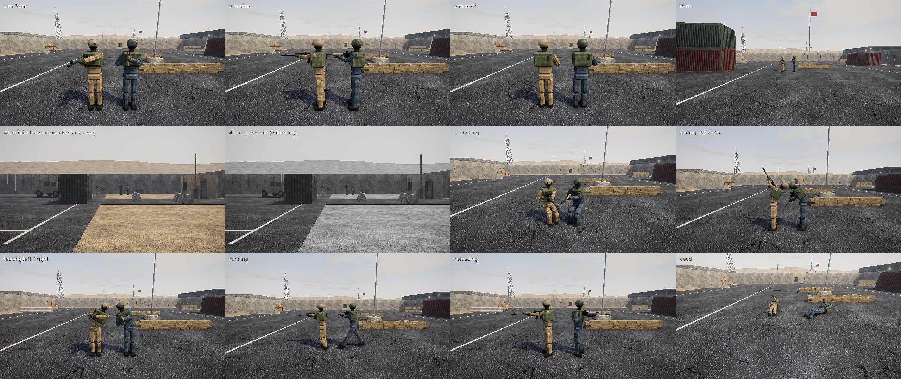

# Overhaul plan: bot intelligence (Milestone 8) and realistic soldiers (Milestone 9)

**Status: Phase 0 done. Waiting for your approval of this plan and the decisions in section 9.**
No feature code has been written. Phase 0 added measuring tools only (`tools/bot_metrics.py`,
`tools/soldier_sheet.py`) and the baseline in [docs/baseline/](baseline/README.md).

## 0. Summary

* **Your diagnosis holds, with corrections.** The bots run one fixed priority ladder, choose the
  closest target, hold one of 11 hand-placed spots with a ±13° scan, pick a random A/D strafe,
  reload at 70 % of the magazine and see the whole team's picture instantly. Corrections and
  additions:
  * The "exact, instant team knowledge" is partly legitimate. The HUD radar already shows a human
    player exact positions of every enemy a teammate sees, for 3 s, so exact sighted positions are
    information a player has. What a player does not have:
    * the exact position of an enemy who shot you from out of sight;
    * the exact position of the killer of a teammate who never saw him;
    * which enemy carries the charge (it is hidden on the carrier);
    * the positions of every enemy gadget near a site, which is how Static picks EMP targets.

    The legacy brain uses all four. I count the first two per round in the baseline. The
    radar itself is also slightly leaky for humans: a teammate's death puts the unseen killer on
    your radar.
  * The biggest spikes in the AI's tick are not decisions. Procedural models are built on demand,
    taking 28-323 ms each: gadget deploys, weapon switches, drone throws and every weapon dropped
    on death. Path queries add spikes of up to 16 ms (282 ticks over 4 ms in 8 rounds). The 4 ms
    spike budget needs both fixed.
  * The scripted utility never fires. Execute flashes and smokes are ordered from 19-35 m, but the
    longest possible throw is about 14.5 m. One grenade was thrown in 56 rounds.
  * The worst behaviour is the fallback: 23 % of deaths happen while "retreating", including most
    deaths while reloading.
  * Difficulty does change two decision rates (grenade use and strafing probability), but no
    judgement.
* **Workstream A** keeps the legacy brain selectable and adds a layered `ai/v2/` package:
  * a precomputed tactical map: tactical points, coarse visibility, cover, chokes and generated
    hold, off-angle, crossfire, peek and pre-fire spots, cached next to the navmesh and patched
    locally when walls break;
  * a knowledge layer: contacts with provenance, a delayed and imprecise radio, radar glances, and
    a team "possibility field" that spreads at enemy speed and is cleared by teammates' eyes;
  * utility-scored actions with commitment;
  * movement and combat controllers on the existing aim and body layers;
  * a team strategy layer with roles, varied plans, mid-round calls, fakes and lurks;
  * personalities, human error and difficulty that scales decision quality.

  A fairness audit guards the knowledge layer at runtime.
* **Workstream B.** I recommend a **hybrid**:
  * Always present: a procedural, CC0-by-construction human with procedural clothing and gear. It
    is the offline fallback and is built to read as human, not as boxes.
  * Optional upgrade: realistic bodies and faces baked from **MakeHuman / MPFB2 assets**, fetched
    by the downloader. I verified in this session that they are **CC0 1.0** (section 6).

  Loading is an offline numpy bake from their plain-text formats, so **no new dependency**.
  Rendering moves to 4-weight linear blend skinning with a `mat3x4` palette in every pass. Skin
  gets a subsurface approximation and fabric gets a sheen term. Death becomes a Bullet ragdoll.
  Hitboxes become bone-parented capsules held within ±10 % of today's areas.
* **What I need from you:**
  * approval of this plan;
  * the decisions in section 9, above all the asset choice (B-1) and the branch for workstream B
    (G-1);
  * optional: allowing `ambientcg.com` and `api.polyhaven.com` in this environment's network
    settings, so I can fetch fabric textures in-session. They are blocked now.

---

## 1. Baseline (Phase 0)

Full numbers, method and files: [docs/baseline/README.md](baseline/README.md). Headline figures
(legacy brain, Normal, pooled over seeds 1-3, 56 rounds, all rounds played; timing from the solo
seed 3 run):

| | legacy baseline | target |
|---|---|---|
| attack round wins | 62 % (35 of 56; CI 49-74 %) | balanced, reported per side |
| deaths while reloading | **19.3 %** of 389 kills; 60 of the 69 in seeds 1-2 happen while "retreating" | lower |
| unseen deaths (killer not seen in the last 5 s) | **8.5 %** | lower |
| traded deaths (within 3 s) | **13.9 %** (22.3 % with a teammate within 15 m) | higher |
| stacking incidents | **3.1 per round** (50 clumps of 3+) | ≤ 0.1 per round |
| stuck bots | **3** in 56 rounds | **0** |
| attack plans | execute **45 %**, default 39 %, rush 16 % | none above 40 % |
| grenades thrown | **1 in 56 rounds** (execute throws are out of range, section 2.1) | used, and effective |
| defender holds | 11 distinct spots; one used in 16 of 24 rounds | varied, adaptive |
| info leaks per round | 2.3 exact attacker positions, 0.64 exact killer broadcasts | 0 (audit) |
| live tick, ms (alone, seed 3) | mean **3.06**, p95 **5.11**, p99 7.54 | mean ≤ 3.97, p95 ≤ 6.64 |
| AI decisions, ms per tick | mean 0.61; **282 ticks over 4 ms** in 8 rounds; max 41 | 0 ticks over 4 ms |
| AI incl. the mesh building it triggers | max **326 ms** | fixed by model caching |
| soldier draw calls per pass | 10 (body 6 + rifle 4) | ≤ 6 LOD0, ≤ 3 far |

---

## 2. Diagnosis: why the bots read as bots

Each point says whether your diagnosis is **confirmed**, **corrected** or **extended**, with the
evidence.

### 2.1 Decisions

1. **One rigid priority ladder: confirmed.** `Brain._think` (`ai/brain.py:331`) checks, in a
   fixed order: keep retreating, then engage a reacted visible enemy, then seek after losing
   sight, then fall back after two unseen hits under 50 HP, then alert on a sound or damage, then
   the team task. Health only enters through `_should_retreat` (under 20 HP, more than 10 m away,
   with a 35 % coin flip) and ammo only through "empty magazine and no pistol". Numbers advantage,
   time left, nearby teammates, the bomb state and exposure are never weighed. Two bots in the same
   situation make the same choice. Only the random burst length and strafe timing differ.
2. **Target choice is the closest reacted contact: confirmed.** `Perception.target`
   (`ai/perception.py:188`). Extended:
   * The target is re-chosen every think (about 7 Hz). Two enemies at similar distances make the
     bot flip between them.
   * Every switch calls `AimController.acquire`, which rolls a fresh aim error, so flip-flopping
     also wrecks accuracy.
   * Who is aiming at the bot, who is exposed, who is hurt and who is reloading are all ignored.
3. **Instant, exact team knowledge: confirmed, then corrected (see Summary).**
   * `TeamBrain.report` pushes every sighting and every heard footstep to every teammate on the
     same tick (`ai/tactics.py:292`).
   * Perception treats a called-out contact as "expected" and cuts the reaction time by 25 %.
   * Contacts are forgotten after 25 s (`perception.py:70`). Nothing models where an unseen enemy
     could be by now.
   * Leaks beyond what a player knows:
     * `Brain.on_damaged` / `Perception.on_damaged` store `attacker.position()` exactly
       (`brain.py:202`, `perception.py:165`). A player only gets a direction arc.
     * `TeamBrain.on_teammate_killed` broadcasts `killer.position()` to the whole team
       (`tactics.py:314`), whether or not the victim saw him.
     * `_update_defend` boosts a rotation when the reported enemy is `bomb.carrier`
       (`tactics.py:521`), but the charge is invisible on the carrier.
     * `GadgetAI._emp` targets every enemy electronic gadget within 16 m of the site from game
       state (`gadget_ai.py:489`).
4. **A handful of hand-placed spots: confirmed.**
   * Defenders: 11 positions, chosen at random within their area (`_hold_in`). They watch a fixed
     yaw with a ±13.2° scan (`_hold_look`: ±22° × 0.6).
   * Every 18-30 s, if nothing has been seen for 12 s, one random defender re-rolls its spot.
   * After a fight a holder walks straight back to the same spot (`_task`: further than 1.2 m away
     means re-path).
   * No crossfires and no off-angles. A spot that just gave away its position is reused.
5. **Generic combat micro: confirmed.**
   * `_strafe` flips direction with probability 0.7 every 0.3-0.75 s.
   * No peek types, no pre-fire, no re-peek from elsewhere, no trading, no baiting.
   * Reloads: at 70 % of the magazine while holding or idle, 60 % in alert, 50 % while seeking.
   * Extended: "seek" walks *towards* the last known position for 2-3.5 s (`_seek`). That is
     exactly the push into the enemy's crosshair that a human punishes.
   * Extended, measured: **"retreat" is where bots die.** In seeds 1-2 it accounts for 77 of
     340 deaths (23 %) and 60 of the 69 deaths while reloading. `_retreat` back-pedals in sight of
     the threat and reloads at 99 %. Cover is the best of 14 random points within 9 m that the
     threat's last known position cannot see. It is often far, and the route to it is exposed.
6. **Mechanical movement: confirmed.**
   * Bots walk only when a task says so (the last 12 m of a rotation) or while seeking. They
     look at a point 4 m ahead on the path at 1.5 m height (`_move_to`).
   * Spacing comes only from a per-bot random polygon cost and the after-the-fact push-apart in
     `_separate_characters`. The baseline counts stacking incidents and where they happen.
7. **Scripted utility only: confirmed.**
   * Grenades: one flash at the site centre and one smoke at the defenders' rotation point per
     execute, and a frag at a heard enemy 7-20 m away (8 s cooldown).
   * **Measured, it is worse: the execute's throws never happen.** The flash target (site centre)
     and the smoke target (rotation point) are 19-35 m from the staging points. With gravity
     20 m/s² and throw speeds of 16-17 m/s the longest flat throw is 12.8-14.5 m, so `_do_throw`
     finds no arc and drops the order. A probe of all 12 lane / grenade pairs finds every one out
     of range. One frag was thrown in 56 rounds.
   * Defenders throw nothing on purpose.
   * No bot reacts to incoming utility. Flash blindness only depends on where the bot happened to
     look, there is no frag avoidance, and smoke is only a sight blocker.
8. **Difficulty changes only mechanics: confirmed, slightly corrected.** `data/bots.json` changes
   reaction, turn speed, aim error, recoil control, field of view and hearing. It also changes two
   rates: `grenades` (the chance to obey a throw order) and `strafe`. No judgement changes.
9. **No roles, personalities or adaptation: confirmed.** The only memory is `site_history` (each
   plant adds 0.5 to that site's weight). The AWPer is the richest bot, half the time.

### 2.2 Engineering findings that matter for the plan

* **Spikes.** In the baseline the AI's decisions exceed 4 ms in a tick about 35 times per round.
  Including what the AI triggers, the worst spikes are procedural meshes built on demand.
  * Inside the AI's call path:
    * `Tactical.deploy` building a gadget model: up to 323 ms;
    * `CharacterBody.set_weapon`, which **rebuilds and flattens the third-person weapon model on
      every switch** (bots switch to the charge to plant, to grenades to throw, to the pistol):
      up to 168 ms;
    * drone throws: about 28 ms.
  * The same `build_weapon_model` / `add_chamfer_box` path also runs on every death, when the
    victim's gun drops (about 135 ms). That is why a bot's killing shot is expensive (mean 9.5 ms
    per shot).

  Pure decision spikes come from path queries: `find_path` (p99 7.4 ms, max 16 ms) through
  `_lane_path` on long lanes and `_preaim`. Garbage-collection pauses are rare (p99 0.9 ms,
  max 59 ms) and not caused by the AI.
* **Hitbox lag (verified).** Hitboxes are children of the body parts, and Bullet only reads their
  transforms in `PhysicsWorld.step`. Test: move a posed body 1 m. A ray at the new position misses
  until the next step, and a ray at the old position still hits. Bots animate and fire *after* the
  physics step in the same tick, so shots test the pose from the start of the tick. That is up to
  one tick (15.6 ms, about 8 cm at a run) behind. With frame interpolation of the body root, hit
  tests can depend on the frame rate. Workstream B syncs hitboxes explicitly after posing.
* **Determinism.**
  * Gameplay randomness uses the bots' and teams' own `Random`. Global `random` is used only by
    debris, decals and particles, which never touch gameplay masks.
  * Bullet uses one sub-step per tick.
  * Verified: two runs of seed 5 printed identical logs (every kill time, plant, defuse, result,
    shot count, money). This holds with the demos' fixed frame time. In interactive play, hit
    registration can depend on the frame rate (the hitbox-lag point above). v2 keeps all
    randomness on per-bot and per-team `Random`s, including traits.
* **Cost structure** (live ticks, this machine): AI is about 0.61-0.66 ms of a 3.06 ms tick (about
  20 %). The rest is Bullet, character movement, body animation and the Siege layer. Body
  animation already costs about 0.07 ms per moving soldier (0.69 ms for 10).

### 2.3 Soldiers (workstream B): what exists



*`python tools/soldier_sheet.py`: 2 m front, side and back; 10 m; 40 m at the pixel size of a
1080p screen, in colour and greyscale; crouching; aiming at +60/-60; leaning; running;
"reloading" (no animation exists); dead. Vanguard is on the left of each pair, Bastion on the
right.*

* **Body.** 13 rigid parts (box limbs, a sphere head in the glove material as a balaclava). A
  helmet, goggles, a vest, gloves and boots are bolted onto them.
  * Rendering: one skinned mesh per material, **6 Geoms and 1,760 triangles** for the body, plus
    **4 Geoms and 884 triangles** for the rifle, so 10 draw calls per soldier per pass.
  * Skinning: 24-bone rigid palette, `mat4`, 384 vertex-uniform components.
  * Visible gaps at the shoulders, elbows and knees. No hands, no feet, no face.
* **Animation.** Procedural leg swing, crouch fold, aim pitch over spine, chest and gun, lean roll,
  two-bone arm IK. No reload, switch, throw, plant or defuse motion. No turn-in-place. Death tips
  the rigid body over around the feet.
* **Readability.**
  * At 40 m the teams separate by hue (tan / slate) and somewhat by value: tan is lighter.
  * Helmet colours differ, but the silhouettes are identical.
  * The bomb is hidden on the carrier. Only attackers see the carrier, on the radar.
* **Hitbox exposed areas** (cm², 5 mm ray grid, from `docs/baseline/soldier_stats.json`). These are
  the ±10 % reference for workstream B:

| view | head | chest | stomach | arm | leg | total |
|---|---|---|---|---|---|---|
| stand front | 383 | 950 | 1317 | 1070 | 2570 | 6291 |
| stand side | 377 | 440 | 700 | 1107 | 1450 | 4074 |
| crouch front | 383 | 1009 | 786 | 1138 | 1658 | 4973 |
| crouch side | 376 | 448 | 687 | 1106 | 1316 | 3934 |

---

## 3. Workstream A architecture (Milestone 8)

```
             +---------------------------------------------------------+
  team       |  TeamStrategy (ai/v2/strategy.py)                       |  4 Hz
  layer      |  plan + roles + calls; reads TeamKnowledge, issues      |
             |  Intents (area, role, timing), never exact enemy pos    |
             +-----------------------------+---------------------------+
                                           | intents (radio-delayed)
             +-----------------------------v---------------------------+
  bot        |  Brain v2: UtilitySelector (ai/v2/utility.py)          |  ~7 Hz, staggered
  decisions  |  actions scored from considerations + traits + role,   |
             |  hysteresis / commitment; owns the current Action      |
             +-----------------------------+---------------------------+
                                           | action -> controller goals
             +-----------------------------v---------------------------+
  controllers|  Movement (walk / slice / spacing), Combat micro (peeks, |  64 Hz
             |  pre-fire, re-peek, reload discipline), Aim policy      |
             |  (crosshair placement) -> AimController (kept), Intent  |
             +---------------------------------------------------------+
  knowledge  Perception (kept, + attention) -> BotKnowledge (contacts with provenance)
             Comms (delayed, area-precision callouts) + radar glances -> TeamKnowledge
             PossibilityField (per team, over tactical points)
  analysis   TacticalMap (precomputed, cached): points, visibility, cover, chokes, spots
```

### 3.1 Selecting the AI

* `--ai legacy|v2` (default `v2` once it beats legacy). Per team: `--ai attack=v2,defend=legacy`
  or `--ai team0=v2,team1=legacy`. "team0/team1" follow a team across the halftime swap, which is
  how the head-to-head swaps sides. Console: `ai v2`, `ai legacy`.
* `MatchDirector` creates `Brain` or `BrainV2` per bot and `TeamBrain` or `TeamStrategy` per team.
  Both brains drive the same `BotAgent` (`Intent`, `AimController`, `Perception`, inventory,
  character).
* The legacy modules stay byte-for-byte as they are, so the baseline stays reproducible. Shared
  fixes that change no decisions (model caching, see 3.10) apply to both.

### 3.2 Tactical map analysis (`ai/v2/tactical_map.py`), precomputed and cached

* **Occupancy.** A 3D bool grid (0.5 m horizontal, 0.25 m vertical) is rasterised from the same
  collider boxes as the navmesh, reusing `ai/navmesh.rasterize`. Destructible panels go into a
  separate grid of panel ids.
* **Tactical points.** Walkable sample points: a 2.5 m grid over the navmesh, denser (about 1 m)
  along walls, at polygon corners, at portals narrower than 2 m (doorways, chokes) and at the
  hand-placed `practice_positions`. That is about 2-3k points on the compound. Each point gets:
  * its area (callout) and floor level;
  * cover directions: 16 directions × {crouch 1.1 m, stand 1.6 m}, blocked within 1.2 m;
  * an "edge" flag: next to a cover edge, where a side-step changes visibility.
* **Visibility.** Point-to-point line of sight at standing and crouched eye height within 60 m,
  by a vectorised numpy DDA through the occupancy grid. Stored as one bitset row per point (about
  1 MB). Pairs blocked only by destructible panels keep the panel ids in a side table.
  * Target: under 10 s on first start, cached as `assets/cache/nav/<map>_<hash>_tactical.npz`
    keyed by the collider hash, like the navmesh. A test checks samples against Bullet ray casts.
* **Derived data**, all cheap lookups at runtime:
  * **Exposure** of each point to each area, and **lane danger** per navmesh polygon (how many
    likely holds see it).
  * **Hold spots** per site and per mid area: cover nearby, sight of an entry, not seen from far
    away.
  * **Off-angles**: holds that see an entry from an unusual direction or depth, and are not the
    hand-placed spot or the obvious corner.
  * **Crossfire pairs**: two holds that see the same entry at an angle of 60° or more, and cannot
    both be seen from one spot of the entry within 50° of view.
  * **Peek spots**: an edge point, plus the side-step that opens a sight line.
  * **Pre-fire lists**: for a route, the ordered common holds that come into view, with the step
    where each one appears.
  * **Flank routes**: k alternative routes with a penalty on polygons already used.
  * The hand-placed spots become hints with a bonus weight, not the only options.
* **Destruction.** `DestructionManager` already notifies listeners (`navlinks`). When a panel opens,
  the pairs that list that panel id are re-tested with Bullet rays, time-sliced at a few hundred
  rays per tick, and a new murder hole changes exposure only around it.

### 3.3 Knowledge, comms and belief (`ai/v2/knowledge.py`, `comms.py`, `belief.py`)

* **BotKnowledge.** Every fact about an enemy is a `Fact(enemy_ref, pos, radius, time, source)`.
  The source is one of:
  * `sight` (from Perception);
  * `sound` (heard, fuzzed with distance, as today);
  * `damage_dir`: a bearing and a range guess, the bot-side equivalent of the HUD damage arc, not
    an exact position;
  * `radio` (a teammate's callout after delay);
  * `radar` (a glance at the HUD radar);
  * `intel` (pings from drones, cameras and gadgets, which the human HUD also shows);
  * `killfeed` (who died; never a position).

  Every action that aims, fires, pre-aims or paths "at an enemy" must cite a fact, which feeds the
  audit (3.9).
* **Comms channel.**
  * A teammate's sighting becomes a radio callout after a delay drawn per message: 0.3-1.0 s,
    longer under stress, set by difficulty and teamwork.
  * Callouts carry area precision: callout name + a position snapped to the area's nearest
    tactical point and fuzzed by 2-4 m. Also the count, "tagged" or "low" (only from damage the
    caller itself dealt), and the direction of movement.
  * Text in the existing radio style: "Two B Long, one tagged", "Last one low, A site",
    "Falling back", "I'll trade you", "Rotating B", "Lurking mid", "Flash going A".
  * Rate-limited, and a bot in a fight calls less.
* **Radar glances.** The HUD radar gives humans exact spotted positions for 3 s. Bots may read it
  too, but only at glance moments: every 1.5-4 s by difficulty and attention, never while
  engaging. That keeps it a channel a player really has, with a player's attention cost.
* **Possibility field** (per team, over tactical points). For every point, `ready[p]` is the
  earliest time an enemy could be there given everything the team knows.
  * Seeded from the enemy spawn at round start (precomputed arrival times).
  * Lowered to `t` by a fact at `p` (radius-spread).
  * Spread each update by vectorised relaxation over the point graph:
    `ready = min(ready, ready[nb] + dist / speed)` at run or walk speed. Speed is chosen by the
    sound evidence: running enemies are heard.
  * Points currently seen by any teammate (visibility bitset ∧ view cone) are set to "not here
    now" and must be re-reached from outside.
  * Weighting uses the known number of living enemies (kill feed), the time since each point was
    last seen, and priors from hold or lane statistics. That ranks where to pre-aim, what to clear
    first, where a rotation is needed, and where a flank or lurk is safe.
  * Cost: numpy on about 3k points at 4 Hz for 2 teams, about 0.1 ms per tick on average. The
    field is drawn on the radar with a debug toggle.

### 3.4 Individual decisions (`ai/v2/utility.py`, `actions.py`)

* **Actions** (the current modes become actions; new ones are marked +):
  * engage;
  * hold angle;
  * + reposition: after a kill, after being spotted, or on a timer;
  * + peek: jiggle (information), wide swing with a trade partner, shoulder bait, re-peek from a
    different spot;
  * + pre-fire;
  * + clear (corner by corner);
  * advance, which becomes travel with walk and spacing rules;
  * fall back, which replaces retreat;
  * + reload safely;
  * + trade;
  * + support utility (flash for a teammate's peek, smoke to cross);
  * + avoid utility (turn from a visible flash, leave the frag radius, wait out or push smoke);
  * + lurk; + rotate (partial);
  * plant / defuse / guard / retake / save / hunt / pick up the charge;
  * + bait.
* **Considerations**, as curves normalised to 0..1, with weights in `data/bots.json` under "v2":
  * health and armour; magazine and reserve; weapon versus distance;
  * numbers advantage (kill feed); a teammate within trade distance and whether he is looking the
    same way;
  * time left; bomb state; the bot's believed exposure (possibility field × visibility); cover
    available within 3 m;
  * stress; role and trait multipliers.
* **Selection.** Score = weight × product of the curves (with the standard compensation for the
  number of factors). The current action gets a commitment bonus until its minimum duration, and a
  new action must beat it by a margin (hysteresis). Ties are broken by low-temperature softmax
  noise from the bot's own `Random`. Per difficulty: easy is noisier and more impulsive, expert
  sharper and more patient.
* **Target priority** (engage): a threat score built from:
  * is aiming at me (its view direction is visible);
  * time to kill it (its believed damage taken, my weapon, the hit group I can see);
  * distance and exposure;
  * it is engaging a teammate;
  * the current target is sticky (hysteresis), so there is no aim-error re-roll on flip-flops.

### 3.5 Controllers (`ai/v2/controllers.py`)

* **Movement.**
  * Walk silently when the possibility field says an enemy is within about 20 m of the next 15 m
    of path.
  * Crosshair at head height on the next likely angle while moving: the highest-ranked
    possibility point visible ahead, otherwise the next corner (`_preaim` generalised).
  * Slice the pie at corners: approach on the outer arc, with the aim leading the edge.
  * Clear rooms with the pre-fire list in order.
  * Spacing: no teammate within 1.2 m. A doorway (a choke point) is claimed by one bot at a time,
    and others wait 2 m back. Bots never stop inside a doorway.
* **Combat micro.**
  * Peek types: jiggle (0.15-0.3 s out, back), wide swing, shoulder.
  * Counter-strafe before firing (kept).
  * Fall back and re-peek from a different edge.
  * Reload only out of sight (no visible enemy, not exposed to an uncleared point) or behind
    cover. Otherwise switch to the pistol or fall back.
  * Reposition after a kill if the spot is now known to the enemy (the killer was seen).
  * Utility reactions: turn away from a flash seen in the air (a projectile is visible like an
    enemy), leave a frag's radius, smoke behaviour by role.
* `AimController` is kept as the low-level layer. Humanisation wraps it (3.7).

### 3.6 Team strategy (`ai/v2/strategy.py`)

* **Roles each round** from loadout, traits and the plan:
  * attack: entry, trade/second, support (utility), lurker, AWPer;
  * defence: anchor, rotator, AWPer, support.
* **Attack plans**, weighted, with an anti-repetition decay and economy:
  * slow default with a mid-round call;
  * fast execute with timed utility (smoke the rotation, flash the entry 0.4 s before the
    swing);
  * split (two lanes, synchronised);
  * fake (utility and noise on one site, then rotate);
  * late lurk (one player holds a flank, then hits the rotation);
  * rush (eco);
  * contact (walk until first information).

  No single plan above 40 % of rounds.
* **Defence setups**: 2-1-2, stack, aggressive information play, retake setup, with off-angles
  and crossfires from the tactical map. Within a round:
  * reposition after giving away a spot;
  * 1-2 rotators shift on credible information: two independent sightings, or one sighting plus
    utility. Fakes can fool them, by design.
  * Anchors hold or fall back to wait for the retake.
* **Adaptation across rounds** uses only what the team actually observed: where attackers
  appeared, which plans beat them, which spots died. Defender spots that died twice get
  down-weighted, so a peeker meets a different angle or a pre-aim next time.
* **Post-plant**: crossfire spots on the charge. **Retake**: group, utility, then a timed
  entry.

### 3.7 Roles, personalities, humanisation, difficulty (`ai/v2/personality.py`, `humanize.py`)

* **Traits** (aggression, patience, teamwork, utility, risk) are derived deterministically from
  `hash(seed, name)` with a `Random` per bot, so a bot plays with a recognisable style.
  `botinfo` shows them.
* **Reaction time**: a lognormal draw (sigma about 0.25) replaces the uniform draw. Its mean
  equals the mean of the profile's current range.
  * The mean equals today's mean, so expected reaction is unchanged; only the shape is more human.
  * In the head-to-head both brains draw from the same sampler.
* **Attention**: tunnel vision on the current target. A second enemy, or one outside a cone of
  about 40° around the target, reacts ×1.3-1.8 slower, by difficulty.
* **Flicks**: large turns are split into a ballistic phase that overshoots or undershoots
  (±8-20 %, by difficulty) and a correction. This is fed through `AimController.turn_towards`
  targets; the controller is unchanged.
* **Stress**: rises on being hit, in a clutch or when flanked, and decays over 3-5 s. It scales aim
  error and decision noise, and on easy it can freeze the bot briefly when flanked.
* **Mistake rates by difficulty**:
  * over-peek (stay out too long);
  * forget a corner (skip one pre-fire point);
  * reload in the open;
  * late trade;
  * ignore a callout.

  Easy stays forgiving: today's mechanics plus these errors.
* **Expert is disciplined, not omniscient.** It respects information and holds commitments, so
  you can beat it by outplaying it: fakes, silent flanks, off-angles, timing. Its information is
  as fair as everyone else's.

### 3.8 Tooling

* `botinfo` and the debug overlay show:
  * the selected action and its top 3 competing scores;
  * role and traits;
  * the chosen cover, peek or hold spot;
  * the fact behind the current aim or path;
  * a radar toggle (`belief`) that draws the possibility field and tactical points.
* `--demo bots` report: the Phase-0 metrics move from `tools/bot_metrics.py` into `BotDemo`, plus
  plan and round-type variety and the fairness audit result. `tools/bot_metrics.py` keeps the
  timing harness and runs the head-to-heads.

### 3.9 Fairness audit (`ai/v2/audit.py`, `--audit` / `BOT_AUDIT=1`)

* **Access guard.** In audit mode the enemy agents' state accessors (`position`, `head_pos`,
  `center_of_mass`, `velocity`, `bomb.carrier`) are wrapped. Each call is checked against a
  whitelist of legal call sites:
  * Perception's ray tests;
  * hearing a noise's source;
  * the kill feed (the alive flag);
  * the radar channel;
  * the HUD's damage-arc direction.

  Any other read from `ai/` is a violation, with its stack.
* **Provenance check.** Every aim, fire, pre-aim and path order of a v2 bot carries the fact it
  acts on. The auditor checks that:
  * the fact existed and was known to that bot at that time (after comms delay);
  * the order's point is within the fact's radius plus the movement since;
  * firing at an enemy requires a currently seen, reacted contact, or a pre-fire or spam point
    backed by a fact.
* The demo prints violations per type. The legacy brain is reported too: it has known leaks (2.1,
  item 3).

### 3.10 Performance plan

* **Budget**: live-tick game logic at most **1.3× the Phase-0 mean and p95**, and **no tick with
  more than 4 ms of AI decisions**.
* Measured with `tools/bot_metrics.py --no-detail` (whole ticks) and the detailed run (breakdown),
  same seeds, same machine.
* **Shared fixes**:
  * build every procedural model once and instance it: third-person weapons (no rebuild on a
    switch), dropped weapons (no build on a death), gadget and drone models;
  * radio HUD text off the AI path.
* **v2 by construction**:
  * the tactical map is precomputed; queries are table lookups;
  * path queries go through a per-tick budget queue: A* with an expansion budget resumes next
    tick, and results are cached per (from-area, to-area, bias);
  * belief fields update at 4 Hz in numpy;
  * utility thinking is staggered across bots and ticks;
  * perception keeps its 11 Hz staggered scans.
* If the budget cannot be met, I stop and bring you options.

---

## 4. Workstream B architecture (Milestone 9)

### 4.1 Skeleton and skinning

* **One game skeleton for every appearance**, about 45 bones:
  * pelvis, 3 spine, neck, head;
  * clavicles, upper arms, **forearm twist** bones, hands;
  * fingers as 3 chains (thumb, index, the other three);
  * thighs, calves, feet, toes;
  * a weapon bone and a pack bone.
* **Linear blend skinning**, up to 4 weights per vertex. The palette is `mat3x4` rows (3 `vec4`
  per bone): 45 bones × 12 = 540 vertex-uniform components, inside the guaranteed 1024 with room
  for the existing uniforms.
  * `skinning.glsl` keeps its single include point, so `pbr.vert`, `prepass.vert` and
    `depth.vert` (main, depth pre-pass, every CSM cascade, local shadows) all change together.
  * Rigid meshes (dummies, the stand-ins' props) use weight 1.0 on one bone through the same path.
  * GLSL 3.30 only, so the macOS 4.1 core profile keeps working.
* **Candy-wrapper twisting** is avoided with twist bones that take 50 % of the forearm roll and
  25 % of the upper arm roll, plus shoulder and hip helper weights. Dual quaternions stay the
  fallback if a test pose still collapses.
* **Hitboxes become capsules** (sphere for the head) attached to the gameplay skeleton's bones.
  Their Bullet transforms are set explicitly after posing (the hitbox lag in 2.2), so a shot tests
  the pose being shown.
  * Sizes are fitted so each hit group's front and side areas, standing and crouched, stay within
    ±10 % of the table in 2.3.
  * **Hitbox sizes are identical for every appearance.**

### 4.2 Body, head, clothing, gear

* **Body.** One continuous skinned mesh per LOD, with no joint gaps. Hands with fingers posed on
  the grip; feet and boots.
* **Two sources**, same skeleton, same output format (section 6):
  * **Procedural human** (always available, CC0 by construction):
    * a lofted anatomical surface: torso, limbs and neck from profile curves along the bones,
      with muscle and fat bulges as data;
    * a head from a deformed sphere with sculpted brow, nose, cheekbones, jaw, lips and ears from
      parametric displacements;
    * hands from parametric fingers;
    * smooth weights by geodesic distance to the bones, normalised to 4.
    * Its realism ceiling for faces is low at 2 m, so headgear and gear cover most of it by
      design.
  * **MakeHuman / MPFB2 human** (if approved):
    * the CC0 base mesh with gender, age, muscle, weight, proportion and face targets applied
      deterministically per bot;
    * reduced to the game skeleton by transferring the CC0 `game_engine` weights;
    * decimated to the LODs offline.
* **Variety**, deterministic from `hash(seed, name)`:
  * faces: target mixes;
  * skin tone: a melanin/haemoglobin model over a detail map, at least 5 tones;
  * build: 3, as soft volume within the shared envelope;
  * men and women;
  * hair and facial hair: procedural shells and cards;
  * eyewear;
  * headgear: helmet with cover and ear protection, cap, balaclava, bare;
  * gear layout: pouch sets, radio side, pack.

  At halftime the uniform changes and the face stays (the appearance seed is the bot's name, not
  its side).
* **Clothing**: combat shirt, trousers and gloves are offset shells of the body in clothing regions,
  with exact weights copied from the body. Fabric detail is normal maps (procedural, or CC0
  ambientCG fabrics through the existing downloader) with wear and dirt.
* **Gear**: the plate carrier, pouches, radio, knee pads, boots, helmets (cover, ear protection,
  mount), cap and goggles are procedural numpy hard-surface models, bound to bones. They are shared
  by both body sources. No insignia, flags, patches, logos or real camouflage patterns.
* **Team readability.** Silhouette and value, not only hue:
  * Vanguard: soft cover helmet with goggles, lighter tan.
  * Bastion: high-cut helmet with ear protection and a bulkier carrier, darker slate.
  * Measured on the greyscale 40 m panel as a mean luminance difference between the teams'
    pixels.
* **Bomb carrier.** A charge pack on the back, shown **only to viewers the rules already tell**:
  attackers and omniscient spectators. Defenders never see it, because the charge is hidden on
  the carrier today.
* **No hidden-state leaks.** No limp or animation that shows HP. Hit flinches are the same at any
  HP.

### 4.3 Materials and shaders

* **Skin**:
  * pre-integrated / wrap-lit diffuse with a curvature term from a baked per-vertex curvature
    (cheap subsurface);
  * roughness about 0.45-0.6 with a two-lobe specular;
  * a darker, rougher lip and eyelid region by mask.
* **Eyes**: cornea specular, iris parallax-free darkening, an occlusion term.
* **Fabric**: a Charlie-style sheen lobe and lower specular. All of it explained in shader
  comments, as in the existing shaders.
* **Materials** go in `data/materials.json` (`skin_*`, `fabric_*`, `gear_*`), with procedural
  textures or CC0 downloads like everything else.
* **Draw calls** (main pass, LOD0, the weapon included):
  1. skin, eyes and teeth (atlas);
  2. clothing (atlas);
  3. gear and headgear (atlas);
  4. hair and beard (alpha-tested);
  5. weapon (third-person weapon merged into one Geom with an atlas).

  That is 5, under the budget of 6. Far LOD: body+clothing+gear in one atlas mesh, plus the
  weapon, is 2. Shadow casters use the far LOD (1 call).

### 4.4 LODs and animation LOD

* Mesh LODs: LOD0 about 12k triangles, LOD1 about 4k, LOD2 about 1.2k (also the shadow caster).
  Switching is by projected size with hysteresis.
* Animation LOD:
  * full rate under 20 m;
  * every 2nd tick at 20-45 m;
  * every 4th tick beyond.
  * Bones are not updated outside the view frustum, and never for hidden bodies.

  The gameplay skeleton and its hitboxes are still posed every tick (about 15 capsules), so
  animation LOD and frustum skipping only ever save the visual palette and mesh work, never hit
  accuracy.
* `_sig` caching stays.

### 4.5 Animation (procedural, with events)

* `CharacterBody.animate(...)` keeps its inputs. Events are added: `fire`, `reload`, `switch`,
  `throw`, `plant`, `defuse`, `hit(dir)`.
* **Locomotion**:
  * gait from speed and direction: walk, run and crouch-walk, 8-way blended;
  * foot plants with ground IK (rays at the feet; stairs and ramps);
  * hip sway;
  * an upper/lower body split, so the aim stays steady while the legs move;
  * turn in place with a foot shuffle past ±45°;
  * jump and land.
* **Weapon handling**:
  * a stance per weapon class;
  * hand IK on the grips (`two_bone_elbow` kept, plus wrist alignment), fingers posed on the grip;
  * reload, switch, grenade throw, plant, defuse and knife as keyframed procedural clips in
    `data/character_anims.json`;
  * firing recoil through the upper body;
  * idle fidgets.
* **Reactions**: additive directional hit flinches.
* **Death**: a Bullet ragdoll of about 11 capsules with cone-twist and hinge limits, starting from
  the current pose and velocity.
  * It collides with the world only; dead bodies keep blocking neither movement nor bullets, as
    today.
  * It settles, then freezes and leaves the simulation until the round resets.
  * Visual only, so it cannot affect `--seed` reproduction.

### 4.6 Integration

All of these switch to the new body:
* bots;
* stand-ins (`build_mannequin` users in `gameplay/agents.py`);
* the player's invisible hitbox body;
* first-person spectating, which collapses the head, hair and headgear bones;
* the halftime restyle (uniform only, the face is kept);
* weapon drops (from the weapon bone);
* the muzzle position for tracers and flashes;
* the over-the-shoulder spectator framing.

Target dummies on the test range stay mannequins. A console toggle `hitboxes` draws the capsules
over the bodies.

---

## 5. Order of work

**Workstream A** (branch and PR per decision G-1). Each step ends with tests green and a short
metrics run:

1. **Infrastructure.**
   * `--ai` selection per team; head-to-head runner;
   * metrics folded into `--demo bots`;
   * fairness audit framework, run on legacy for its reference count;
   * shared spike fixes: build each procedural model once (third-person and dropped weapons,
     gadgets, drones);
   * a path-query budget queue.
2. **Tactical map**: occupancy, points, visibility (vectorised, cached), cover, spots, destruction
   patching, plus tests and a debug view.
3. **Knowledge**: facts and provenance, comms channel and radio text, radar glances, possibility
   field, plus tests.
4. **Utility framework**: considerations, actions ported from the modes, hysteresis, target
   priority, plus tests.
5. **Controllers**: movement (walk, crosshair placement, slicing, spacing), combat micro (peeks,
   pre-fire, re-peek, reload discipline), utility reactions.
6. **Team strategy**: plans with variety, roles, mid-round calls, fakes, lurks, trades and bait,
   post-plant and retake, defender setups and adaptation.
7. **Personality, humanisation and difficulty** (decision quality and mistakes).
8. **Tooling** (`botinfo`, overlay, belief radar).
9. **Tuning loop**: head-to-head, behaviour metrics, audit, performance. Then README / ROADMAP /
   `_comment` docs and the PR.

**Workstream B**:

1. Skeleton definition and LBS skinning in every pass (mat3x4, 4 weights), with skin-weight and
   palette tests. The current mannequin is ported onto it first, so nothing breaks in between.
2. Procedural human (body, head, hands, feet) and procedural clothing and gear. Materials and
   shaders (skin, eyes, fabric).
3. The MakeHuman/MPFB2 path, if approved: the fetcher entries in `tools/download_assets.py`
   (licence check, CREDITS.md) and the bake (`tools/build_characters.py`, also automatic on first
   start, cached).
4. Animation layers and events, ragdoll.
5. Hitbox refit, alignment tests and the console toggle. **Report the areas and ask before going
   further.**
6. Integration everywhere, LODs and animation LOD, performance.
7. Sheets and iteration, a re-run of the A metrics, docs, PR.

---

## 6. Asset sourcing for workstream B

| | 1. Procedural human (numpy) | 2. CC0 human base meshes | 3. Hybrid (recommended) |
|---|---|---|---|
| Source | code + data in this repo | MakeHuman / MPFB2 (verified CC0 1.0), fetched | procedural always; MakeHuman when fetched |
| Realism ceiling | body good at 10 m+; faces doll-like at 2 m | anatomy and faces realistic at 2-10 m (dated skin textures; we shade our own) | as option 2 when fetched, option 1 offline |
| Offline | yes | needs the fallback anyway (non-negotiable 6) | yes |
| Licence | CC0 by construction | CC0, verified per source (below), recorded in CREDITS.md | both |
| Effort | high (faces are the hard part) | medium-high (parsers, weight reduction, decimation, clothing fit) | highest total, lowest risk |
| Repo size | none | none (fetched, baked into `assets/cache`) | none |

**Licence verification done in this session** (raw.githubusercontent.com and git are reachable
from here):

* `makehumancommunity/makehuman` at commit `a8bc2d5` (2024-06-26).
  * `LICENSE.md` §C: "The base mesh and proxies, targets and modifiers, textures, clothes
    (MHCLO), poses and expressions … have been released under CC0 1.0 Universal".
  * §D: the MakeHuman project makes no claim over output.
  * `LICENSE.ASSETS.md` is the CC0 1.0 legal code.
  * Contents: `base.obj`, about 1,550 target files, `default.mhskel` and
    `default_weights.mhw`, eyes, modifiers.
* `makehumancommunity/mpfb2` at commit `d0a32e5` (2026-10-04).
  * `LICENSE.md` §C states the same, explicitly including rigs and JSON mesh data.
  * Contents: `base.obj`, about 1,480 target files, **`rig.game_engine.json` and
    `weights.game_engine.json`** (a game-ready skeleton with weights), vertex groups, face-region
    detail textures.
* Not used: the separate "system assets" (skins, hair, eyebrows, proxies, clothes) and community
  assets. They come from makehumancommunity.org (blocked here), and community assets have mixed
  licences. Hair, brows, skin and clothing are made procedurally instead.
* The fetcher pins these commits, downloads only the files it needs (the base mesh, about 150
  targets, the rig and weights, a few textures), checks each repo's licence file text, and writes
  source, commit, file list and licence to `assets/CREDITS.md`.

**Other candidates, rejected:**
* Blender Studio *Human Base Meshes*: CC0, but `.blend` only, so Blender would be needed in the
  pipeline, and no rig.
* Quaternius *Universal Base Characters* and *Animation Library*: CC0, but stylised faces, and the
  host is blocked here.
* Kenney: blocky.
* Mixamo, RenderPeople, Sketchfab mixes and the CMU mocap database: not CC0.

**Loading.** I recommend an offline numpy bake and **no new dependency**.
* MakeHuman's formats are plain text: OBJ, `.target` offset lists, JSON rigs and weights. The bake
  (stdlib + numpy) writes `assets/cache/characters/<variant>_<hash>.npz`: positions, normals,
  tangents, UVs, 4 joint indices, 4 weights per vertex, per LOD.
* The runtime loads them into `GeomVertexData` the way `build_skinned` already does.
* `panda3d-gltf` would only matter for glTF sources (Quaternius). It also brings Panda's own
  `Character`/`Actor` animation model, which our palette skinning and procedural animation would
  bypass anyway.

**Animation clips**: procedural (no verified CC0 mocap is reachable). Quaternius' CC0 library can
be added later behind the same event interface if you want.

---

## 7. Acceptance criteria and how each is measured

| Criterion | How it is measured |
|---|---|
| **A: v2 beats legacy in ≥70 % of rounds** (identical aim and reaction parameters) | `tools/bot_metrics.py --ai team0=v2,team1=legacy`, Normal, seeds 1-3 × 24 rounds (all rounds played), v2 starting on attack, and the same seeds with v2 starting on defence: 144 rounds, sides swapped at halftime. Reported: v2 round-win %, Wilson 95 % CI, per side. Smaller check runs at Easy and Expert. Both brains use the same `Perception`, `AimController`, profile numbers and reaction sampler; v2's humanisation can only add error. |
| **A: behaviour metrics improve** | v2 vs v2, same seeds and definitions as the baseline (`docs/baseline/`). Deaths while reloading ↓, unseen deaths ↓, trade rate ↑, stacking ≤ 0.1 per round, **stuck = 0**, no attack plan above 40 % of rounds; plus utility effectiveness, exposure, side win rate. |
| **A: fairness audit = 0** | `--audit` during every head-to-head and v2 demo run. The report lists access-guard and provenance violations per type for v2 bots (must be 0), and legacy's for reference. Unit tests feed planted ground truth and assert that it is not used. |
| **A: performance** | Same machine and seeds, `--no-detail` run: live-tick mean and p95 at most 1.3× Phase 0. The detailed run: AI-decision ms per tick, max at most 4 ms, with the count of ticks over 4 ms = 0. Phase-0 values in the baseline README. |
| **A: tests** | New unit tests: utility scoring and hysteresis, belief propagation and clearing, comms delay and precision, tactical point generation and visibility against Bullet, cover and peek queries, role assignment and trait determinism, audit catching a planted leak. |
| **B: before/after sheet** | `tools/soldier_sheet.py` → `docs/images/soldiers_before.jpg` (done) and `soldiers_after.jpg`, same shots, reviewed and iterated. |
| **B: no seams or candy-wrapper** | An extreme-pose sheet (forearm twist ±90°, arms up, deep crouch with lean and pitch) plus automated checks: the body mesh has no open edges outside the neck/wrist/ankle seams covered by clothing; cross-section area of the forearm and upper-arm rings stays at least 70 % of the bind pose under twist. |
| **B: teams at 40 m in greyscale** | The greyscale 40 m panel. Numerically, a render with and without the soldiers gives a pixel mask, and the mean luminance difference between the teams is reported. |
| **B: variety** | A line-up sheet of 10 per team, and a test that counts distinct heads (≥8), skin tones (≥5), builds (3), headgear (≥2/team) and gear variants (≥2/team), and checks that the appearance is the same every round and the face survives halftime. |
| **B: performance** | `soldier_stats.json`: Geoms per soldier at LOD0 ≤ 6 and far LOD ≤ 3 (weapon included), and `animate` CPU per tick for 10 soldiers. You run `--benchmark` on your GPU against the Phase-0 numbers. |
| **B: offline** | The sheet rendered with `COLD_SECTOR_OFFLINE=1` (downloaded character assets ignored) still reads as human. |
| **B: hitboxes** | Areas per hit group within ±10 % (table in 2.3, re-measured), and alignment tests: across a pose set, every capsule stays inside its bone's mesh region and the visual and hitbox head centres coincide within 1 cm. Reported, then I ask before going further. |
| **B: AI balance** | The A behaviour metrics and a head-to-head subset re-run after the new hitboxes. |

---

## 8. Risks

* **70 % against legacy is a high bar.** Legacy aims well and has the info leaks; v2 gives the
  leaks up. If tuning stalls below 70 %, I report the CI and the metric gaps and bring options.
* **Visibility precompute time** on first start. Mitigations:
  * coarser points in open areas;
  * vectorised DDA;
  * the cache;
  * a background build with legacy-style fallback queries until it is ready.
* **MakeHuman decimation and weight transfer** is the riskiest B step; the procedural path does
  not depend on it.
* **Headless verification of visuals** relies on llvmpipe screenshots. The GPU frame rate has to
  come from your `--benchmark`.

---

## 9. Decisions to confirm

**General**

* **G-1. Branches.**
  * Phase 0 and workstream A on this session's branch `claude/upbeat-maxwell-p1h773` → PR A.
  * B on a new branch `claude/upbeat-maxwell-p1h773-soldiers` → PR B. That is a second branch
    name, which I need your OK to push.
  * Both PRs target `claude/funny-galileo-wyhocj`, because `main` is still at Milestone 6.
* **G-2.** The legacy brain stays untouched as the reference, including its leaks. It only gets
  the shared, decision-neutral performance fixes.

**Workstream A**

* **A-1.** The HUD radar counts as a legitimate channel for bots, read at glance moments only;
  voice callouts are delayed and imprecise.
* **A-2.** The reaction time becomes lognormal with the same mean per difficulty; both brains use
  it in the head-to-head.
* **A-3.** Performance is judged on live-tick mean and p95 (game logic), plus max AI-decision time
  per tick. GC pauses and mesh building that the AI only triggers are reported separately; the
  spike fixes remove the mesh building.
* **A-4.** The behaviour metric definitions in `tools/bot_metrics.py` (unseen = no sighting of the
  killer in the 5 s before death; trade window 3 s; stacking = teammates within 0.8 m for 1 s).
* **A-5.** The belief field lives on tactical points (2.5 m grid, denser near cover), not navmesh
  rectangles, which are too coarse for pre-aiming.
* **A-6.** v2 becomes the default once it meets the criteria. Legacy stays behind `--ai legacy`.

**Workstream B**

* **B-1. Asset strategy: hybrid** (procedural always, plus MakeHuman/MPFB2 CC0 fetched and baked).
  I need your approval before fetching any third-party asset.
* **B-2.** No new dependency: an offline numpy bake from plain-text sources, not `panda3d-gltf`.
* **B-3. One skeleton and one hitbox set for every appearance.** Men and women share the joint
  positions, height included. Build variety is soft volume within ±2 cm of the shared envelope,
  which keeps competitive fairness and "hitbox sizes never vary".
* **B-4.** About 45 bones with twist bones, LBS with `mat3x4` (dual quaternions only if needed).
* **B-5.** Draw-call budget counted per pass and including the weapon (target 5 at LOD0, 2 far).
* **B-6.** Ragdoll deaths in Bullet (visual only).
* **B-7.** Procedural animation (no CC0 clips), events added to `CharacterBody`.
* **B-8.** The charge pack is visible to attackers and omniscient spectators only, matching what
  the radar already reveals.
* **B-9.** Nothing binary committed: characters are baked on first start into `assets/cache`.
  The procedural fallback is generated the same way.

---

## Running log

**Done**
* Phase 0: code audit; measuring tools (`tools/bot_metrics.py`, `tools/soldier_sheet.py`);
  baseline in `docs/baseline/`; before sheet `docs/images/soldiers_before.jpg`; asset licence
  checks; this plan.

**In progress**
* Nothing. Waiting for approval.

**Next**
* After approval: A step 1 (infrastructure).

**Open questions**
* The decisions in section 9.
* Optional: allow `ambientcg.com` / `api.polyhaven.com` in the environment's network settings
  (Edit environment → Network access → Custom → allowed domains), so fabric textures can be fetched
  in-session. Otherwise you run `python tools/download_assets.py` locally.
