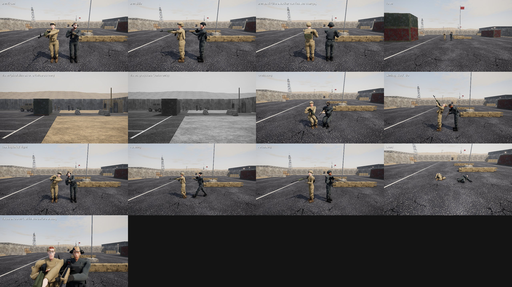

# Milestone 9 results: realistic soldiers

Measured on branch `claude/upbeat-maxwell-p1h773-soldiers` against the Phase 0 baseline
([`docs/baseline/soldier_stats.json`](../baseline/soldier_stats.json), the before sheet
[`docs/images/soldiers_before.jpg`](../images/soldiers_before.jpg)) and the acceptance criteria
in [OVERHAUL_PLAN.md](../OVERHAUL_PLAN.md) section 7. Statistics: [`soldier_stats.json`](soldier_stats.json)
(`tools/soldier_sheet.py --procedural --stats ...`).

*The same shots as the before sheet, plus faces at 0.9 m (the last panel). Vanguard (attack) is
on the left of each pair, Bastion (defence) on the right.*

## Summary

| criterion | target | result | met |
|---|---|---|---|
| skinning | linear blend, 4 weights, in every pass | 47-bone game skeleton, `mat3x4` palette (576 vertex-uniform components), 4 weights per vertex; the main pass, the depth pre-pass and every shadow pass use the same skinning | yes |
| levels of detail | about 12k / 4k / 1.2k triangles | 11.6-11.7k / 3.8-3.9k / 1.19-1.22k for full kits (balaclava kits 9.6k / 3.2k / 1.0k) | yes |
| draw calls per soldier, weapon included | ≤ 6 at LOD0, ≤ 3 far | **5** at LOD0 (body 1, rifle 4), **2** far (body 1, rifle 1); the charge carrier 6 / 3 where the pack shows | yes |
| animation | procedural, with events; ragdoll | reload (the weapon's own reload time), switch, throw, knife, plant and defuse (looping), hit flinch (same at any health); Bullet ragdoll on death, visual only | yes |
| animation LOD | | the palette every tick within 14 m, every second tick to 40 m, every fourth beyond or behind the camera; the hit boxes are posed every tick | yes |
| animation CPU for 10 soldiers | reported | **1.48 ms** per tick for 10 running soldiers near the camera (148 µs each; the mannequin: 69 µs, 0.69 ms), the worst case: the animation LOD solves the palette less often beyond 14 m | reported |
| no seams or candy-wrapper | twist ±90°: rings keep ≥ 70 % | 85-95 % for the forearm and the upper arm (tests); pieces are closed meshes, the head's open neck sits inside the collar | yes |
| variety | ≥ 8 heads, ≥ 5 skin tones, 3 builds, ≥ 2 headgear and gear variants per team; stable; the face survives halftime | 20 distinct faces in a match roster, melanin 0.0-0.92 (≥ 5 tones), 3 builds, men and women; helmet / cap / balaclava; 2-4 pouch layouts, radio side, admin pouch, holster (tests) | yes |
| offline | the sheet with `COLD_SECTOR_OFFLINE=1` reads as human | procedural faces (no downloaded files) | yes |
| teams at 40 m in greyscale | reported | mean luminance of soldier pixels in the 40 m shot: attack 0.289, defence 0.280 (difference 0.009; the mannequins: 0.018) | reported, see below |
| hit boxes | areas within ±10 %, reported, then asked | capsules fitted to the soldier, as you chose, with exact ray tests (table below): in total 8-9 % below the mannequin's, by group -25 % to +24 %; head centres within 1 cm (20 of 20, worst 0.8 cm); every capsule axis inside the body | as decided |
| AI balance after the new hit boxes | the A metrics and a head-to-head subset re-run | head-to-head (seeds 201-202) **38 %** (16/42, CI 25-53), Milestone 8 on the same seeds 50 % (19/38, CI 35-65): within the interval. Hits per shot 50 % → 44 % (smaller targets), deaths while reloading 8.4 % → 12.7 % (still below legacy's 20.3 %); details below | re-run, reported |

## The soldiers

* **Bodies** (`characters/human.py`, `clothing.py`, `gear.py`): signed distance fields along the game
  skeleton's bind pose, meshed with surface nets and simplified with quadric decimation to the LOD
  budgets (`characters/build.py`, `mesher.py`, `decimate.py`). Combat shirt (full or rolled sleeves),
  trousers, boots, gloves or bare hands, plate carrier with pouches, radio, admin pouch and holster
  per layout, belt and knee pads; helmet (cover, ear protection, goggles), cap or balaclava.
* **Faces**: MakeHuman / MPFB2 (CC0) heads when the files are fetched
  (`python tools/download_assets.py --only characters`; `characters/makehuman.py`): the base mesh
  with ethnicity, build and face-proportion targets per bot, placed on the game skeleton. Without
  them, or with `COLD_SECTOR_OFFLINE=1`, a procedural head. Hair, beards and brows are paint plus,
  for hair and full beards, a layer grown from the skin.
* **Materials** (`render/shaders/character.frag`): one draw call per soldier per pass; the colours
  are a per-team palette table, the shading per slot kind (skin with wrap lighting and two specular
  lobes, fabric sheen, hard surfaces, eyes, hair, lenses), a small shared detail texture.
* **Animation** (`gameplay/body.py`, `data/character_anims.json`): procedural gait, crouch, aim,
  lean, two-bone arm IK onto the weapon, clips for the events above, an additive hit flinch.
  Ragdoll (`gameplay/ragdoll.py`): 11 capsules with cone-twist and hinge limits, from the pose at
  death; it settles and freezes within a few seconds.
* **The charge on the carrier's back** (B-8): one Geom on the plate carrier, shown only to views that
  may know the carrier (attackers and omniscient spectators, the radar's rule for its charge mark:
  `MatchDirector.charge_visible`), hidden while the charge is in the hands or after death. The
  sheet's back shot shows it.
* **Build cost**: about 16 s per soldier and kit, once; 20 for a match are built in parallel at the
  first start and cached in `assets/cache/characters/`.

## Hit boxes

Capsules on the bones (`gameplay/hitboxes.py` `CAPSULES`), the same for every appearance, fitted to
the visible soldier (`tools/fit_hitboxes.py`). Areas in cm² as the game's ray tests see them (5 mm
grid, first hit; `soldier_sheet.py --stats`, the method of the baseline) against the mannequin's;
"visible, no hit box" is the soldier's silhouette with no capsule behind it, "hit box, nothing
visible" the capsule outside the silhouette.

| view | head | chest | stomach | arm | leg | total | visible, no hit box | hit box, nothing visible |
|---|---|---|---|---|---|---|---|---|
| stand front | 387 (+1 %) | 857 (-10 %) | 1334 (+1 %) | 889 (-17 %) | 2308 (-10 %) | 5775 (-8 %) | 437 | 294 |
| stand side | 383 (+2 %) | 510 (+16 %) | 772 (+10 %) | 832 (-25 %) | 1211 (-16 %) | 3708 (-9 %) | 756 | 218 |
| crouch front | 388 (+1 %) | 835 (-17 %) | 974 (+24 %) | 926 (-19 %) | 1380 (-17 %) | 4503 (-9 %) | 237 | 328 |
| crouch side | 384 (+2 %) | 510 (+14 %) | 747 (+9 %) | 834 (-25 %) | 1143 (-13 %) | 3618 (-8 %) | 473 | 272 |

In the front views the thighs' edges fall exactly on the 5 mm grid, so the leg and total cells
there move by up to 40 cm² between runs (sampling, not the game).

With the old boxes on the new soldier the mismatch was 288 + 696 cm² from the front and 524 + 385
from the side. No capsule set keeps every group within ±10 % of the mannequin's areas: the
soldiers hold the rifle across the chest, and the arms cover the chest and stomach.

**Exact ray tests.** Bullet tests a ray against a capsule as a convex cast with a tolerance: it
reported hits up to 6 mm outside a capsule and entries up to 5 mm early (14 mm at grazing angles).
Its spheres and boxes, which the mannequin used, are exact. In game that made the capsules about
4 % larger than fitted (totals 3-5 % below the mannequin's instead of 8-9 %) and, where two
capsules overlap at a slant (pelvis and thigh, arm and stomach from the side), could give the hit
to the one behind. Every ray Bullet reports on a capsule is now re-tested exactly
(`engine/physics.py` `segment_capsule`): shots, knives and the bots' line-of-fire checks. The
table above is after the fix; the game's outline now equals the fitted capsules. Cost: 0.003 ms
per tick on average in a bot match, p99 0.11 ms.

The table you chose from (B5) came from `tools/fit_hitboxes.py`, which projects the capsules: the
same outline, but its split between overlapping groups is approximate, so its groups differ from
these by up to a third (stand side: stomach 596 and leg 1387 there, 772 and 1211 here).

Shots test the pose of the last physics step, as before (Panda's Bullet moves kinematic bodies
only inside the step; at most one 15.6 ms tick behind); the exact test uses that same pose. Kept as
you chose.

## AI balance with the new hit boxes

Re-run on the final code (exact capsules), the same way as Milestone 8 (JSON in
[`balance/`](balance/)): a head-to-head subset, full matches with sides swapped at halftime, and
the v2-against-v2 behaviour matches.

| head-to-head, v2 against legacy | v2 won | on attack | on defence |
|---|---|---|---|
| seed 201 | 5 / 18 | 5 / 12 | 0 / 6 |
| seed 202 | 11 / 24 | 6 / 12 | 5 / 12 |
| **both** | **16 / 42 (38 %, CI 25-53)** | 11 / 24 | 5 / 18 |
| Milestone 8 hit boxes, same seeds | 19 / 38 (50 %, CI 35-65) | 12 / 19 | 7 / 19 |
| the capsules before the exact ray test | 19 / 45 (42 %, CI 29-57) | 12 / 23 | 7 / 22 |

The two seeds moved in opposite directions (201: 13/19 → 5/18; 202: 6/19 → 11/24): one changed
hit early in a match sends it elsewhere, so a two-match subset only rules out a large shift. All
three intervals overlap. v2 kills 137, deaths 166; the fairness audit found 0 v2 violations.

| v2 against v2, mean of seeds 1 and 2 | legacy | Milestone 8 | Milestone 9 |
|---|---|---|---|
| bullet hits / shots % | 39.5 | 50 | **44** |
| headshot kills % | 35 | 27 | 31.5 |
| deaths while reloading % | 20.3 | 8.4 | **12.7** |
| unseen deaths % | 8.4 | 9.2 | 5.0 |
| deaths traded within 3 s % | 13.6 | 11.9 | 15.9 |
| stacking incidents per round | 3.38 | 1.38 | 1.79 |
| stuck bots | 2 + 0 | 0 + 1 | 0 + 0 |
| attack round wins % | 62 | 60.5 | 64.5 |

What changed is what the smaller hit boxes predict: 8-9 % less area to hit, so fewer hits per
shot, longer fights and more of them ending in a reload. The other rows moved by about as much as
two runs of the same code differ (Milestone 8 results, decision 2).

## Teams at 40 m

The 40 m shot is backlit: the soldiers' fronts are in shade and, at about 8 pixels wide, their
edges blend into the wall behind them, so the uniforms' albedo difference (attack shirt about 0.54,
defence about 0.29 in sRGB) mostly disappears in the measured luminance. By hue the teams stay
apart (tan and slate). Changing the team colours is a design call; not done.

## Known issues

* Hair lines and brows are limited by the head's vertex spacing (about 1 cm at LOD0): soft at 2 m.
* The first start builds every soldier once (about 1.5-2 minutes for a full match on 4 cores).
* The team colours separate by hue more than by value at 40 m (above).
